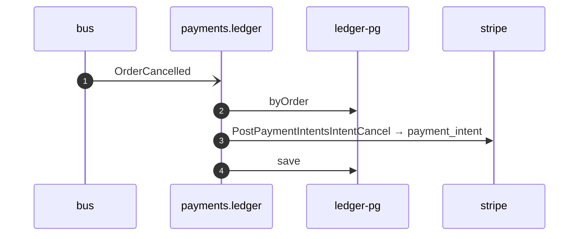

# Void payment on order cancelled

*Generated from the portolan catalog · commit `5 sources` · at 2026-09-05T13:47:23+07:00. Do not edit by hand.*

- **Id:** `flow.ledger-void-payment-on-order-cancelled`
- **Owner:** [payments](../payments/README.md)
- **Source:** [`examples/payments/ledger/src/main/java/org/portolan/payments/ledger/application/policy/VoidPaymentOnOrderCancelled.java`](https://github.com/shortlink-org/portolan/blob/main/examples/payments/ledger/src/main/java/org/portolan/payments/ledger/application/policy/VoidPaymentOnOrderCancelled.java)

Gives back what was held once the order it was held for is gone.

## Participants

| Participant | Kind | Context |
| --- | --- | --- |
| `bus` | broker | — |
| `payments.ledger` | service | [payments](../payments/README.md) |
| `ledger-pg` | store | [payments](../payments/README.md) |
| `stripe` | external | — |

## Sequence

## Steps

1. **bus** → **payments.ledger** — OrderCancelled
   [`shop.oms.order.OrderCancelled`](../shop/oms/aggregates/order.md#event-shop-oms-order-ordercancelled) · status: declared · [`examples/payments/ledger/src/main/java/org/portolan/payments/ledger/application/policy/VoidPaymentOnOrderCancelled.java:25`](https://github.com/shortlink-org/portolan/blob/main/examples/payments/ledger/src/main/java/org/portolan/payments/ledger/application/policy/VoidPaymentOnOrderCancelled.java#L25)

2. **payments.ledger** → **ledger-pg** — byOrder
   status: declared · [`examples/payments/ledger/src/main/java/org/portolan/payments/ledger/application/payment/usecase/VoidPayment.java:29`](https://github.com/shortlink-org/portolan/blob/main/examples/payments/ledger/src/main/java/org/portolan/payments/ledger/application/payment/usecase/VoidPayment.java#L29)

3. **payments.ledger** → **stripe** — PostPaymentIntentsIntentCancel → payment_intent
   `stripe.v1/PostPaymentIntentsIntentCancel` · status: declared · [`examples/payments/ledger/src/main/java/org/portolan/payments/ledger/application/payment/usecase/VoidPayment.java:35`](https://github.com/shortlink-org/portolan/blob/main/examples/payments/ledger/src/main/java/org/portolan/payments/ledger/application/payment/usecase/VoidPayment.java#L35)

4. **payments.ledger** → **ledger-pg** — save
   status: declared · [`examples/payments/ledger/src/main/java/org/portolan/payments/ledger/application/payment/usecase/VoidPayment.java:36`](https://github.com/shortlink-org/portolan/blob/main/examples/payments/ledger/src/main/java/org/portolan/payments/ledger/application/payment/usecase/VoidPayment.java#L36)
