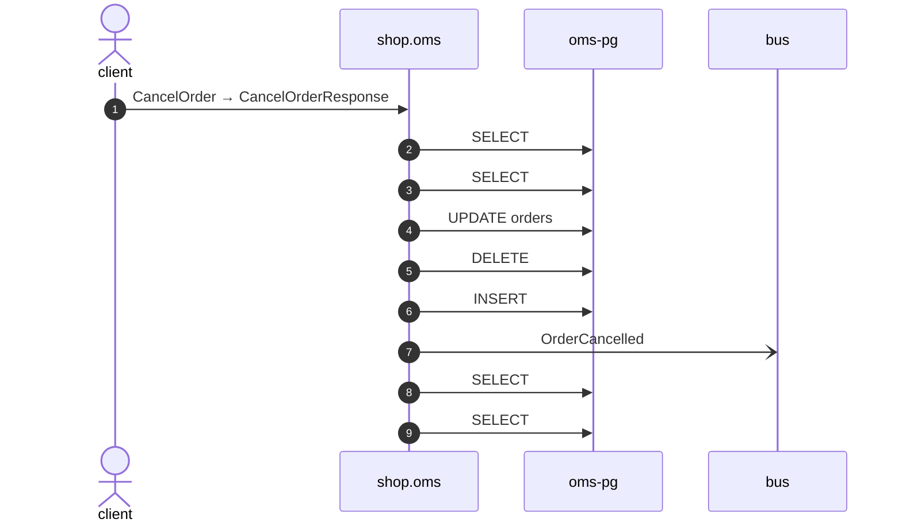

# Observed: CancelOrder

*Generated from the portolan catalog. Do not edit by hand.*

- **Id:** `flow.observed-oms-cancelorder`
- **Owner:** [shop](../shop/README.md)
- **Source:** [`examples/shop/oms/telemetry/traces.jsonl`](https://github.com/shortlink-org/portolan/blob/main/examples/shop/oms/telemetry/traces.jsonl)

Read from 1 trace in examples/shop/oms/telemetry/traces.jsonl. No flow in the catalog opens this way, so the sequence is written down as it was seen.

## Participants

| Participant | Kind | Context | Entity |
| --- | --- | --- | --- |
| `client` | actor | — | — |
| `shop.oms` | service | [shop](../shop/README.md) | — |
| `oms-pg` | store | [shop](../shop/README.md) | [shop.oms.pg](../shop/oms/stores/pg.md) |
| `bus` | broker | — | — |

## Sequence

## Steps

1. **client** → **shop.oms** — CancelOrder → CancelOrderResponse
   seen in 1 recording

2. **shop.oms** → **oms-pg** — SELECT
   seen in 1 recording

3. **shop.oms** → **oms-pg** — SELECT
   seen in 1 recording

4. **shop.oms** → **oms-pg** — UPDATE orders
   seen in 1 recording

5. **shop.oms** → **oms-pg** — DELETE
   seen in 1 recording

6. **shop.oms** → **oms-pg** — INSERT
   seen in 1 recording

7. **shop.oms** → **bus** — OrderCancelled
   [`shop.oms.order.OrderCancelled`](../shop/oms/aggregates/order.md#event-shop-oms-order-ordercancelled) · seen in 1 recording

8. **shop.oms** → **oms-pg** — SELECT
   seen in 1 recording

9. **shop.oms** → **oms-pg** — SELECT
   seen in 1 recording

## Recordings

Traces this flow was seen running in, kept as examples: which steps ran, how long each took, and the names the spans carried.

- **Recording:** [`examples/shop/oms/telemetry/traces.jsonl`](https://github.com/shortlink-org/portolan/blob/main/examples/shop/oms/telemetry/traces.jsonl)
- **Trace:** `b23aa3f8bb39a65d8b5000d5741081aa`
- **Recorded:** 2026-09-04T19:48:30.544095Z
- **Duration:** 6.374 ms

| Step | Span | Duration | Attributes |
| --- | --- | --- | --- |
| [s1](observed-oms-cancelorder.md#step-s1) | `shop.v1.OrderService/CancelOrder` | 6.374 ms | `rpc.method=CancelOrder` `rpc.service=shop.v1.OrderService` `rpc.system=grpc` |
| [s2](observed-oms-cancelorder.md#step-s2) | `SELECT` | 1.046 ms | `db.collection.name=orders` `db.operation.name=SELECT` `db.system.name=postgresql` |
| [s3](observed-oms-cancelorder.md#step-s3) | `SELECT` | 0.898 ms | `db.collection.name=order_lines` `db.operation.name=SELECT` `db.system.name=postgresql` |
| [s4](observed-oms-cancelorder.md#step-s4) | `UPDATE orders` | 0.75 ms | `db.collection.name=orders` `db.operation.name=UPDATE` `db.system.name=postgresql` |
| [s5](observed-oms-cancelorder.md#step-s5) | `DELETE` | 0.224 ms | `db.collection.name=order_lines` `db.operation.name=DELETE` `db.system.name=postgresql` |
| [s6](observed-oms-cancelorder.md#step-s6) | `INSERT` | 0.221 ms | `db.collection.name=order_lines` `db.operation.name=INSERT` `db.system.name=postgresql` |
| [s7](observed-oms-cancelorder.md#step-s7) | `publish oms.OrderCancelled` | 0.285 ms | `event.name=oms.OrderCancelled` `messaging.destination.name=shop.oms.order` `messaging.operation.type=publish` `messaging.system=outbox` |
| [s8](observed-oms-cancelorder.md#step-s8) | `SELECT` | 0.714 ms | `db.collection.name=orders` `db.operation.name=SELECT` `db.system.name=postgresql` |
| [s9](observed-oms-cancelorder.md#step-s9) | `SELECT` | 0.776 ms | `db.collection.name=order_lines` `db.operation.name=SELECT` `db.system.name=postgresql` |
