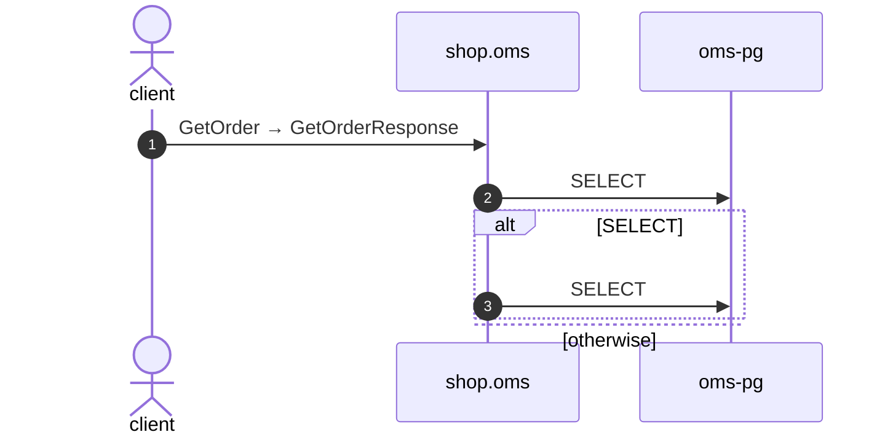

# Observed: GetOrder

*Generated from the portolan catalog. Do not edit by hand.*

- **Id:** `flow.observed-oms-getorder`
- **Owner:** [shop](../shop/README.md)
- **Source:** [`telemetry/traces.jsonl`](https://github.com/shortlink-org/portolan/blob/main/telemetry/traces.jsonl)

Read from 2 traces in telemetry/traces.jsonl. No flow in the catalog opens this way, so the sequence is written down as it was seen.

## Participants

| Participant | Kind | Context | Entity |
| --- | --- | --- | --- |
| `client` | actor | — | — |
| `shop.oms` | service | [shop](../shop/README.md) | — |
| `oms-pg` | store | [shop](../shop/README.md) | [shop.oms.pg](../shop/oms/stores/pg.md) |

## Sequence

## Steps

1. **client** → **shop.oms** — GetOrder → GetOrderResponse
   seen in 2 recordings

2. **shop.oms** → **oms-pg** — SELECT
   seen in 2 recordings

> **One of**
>
> *SELECT — seen in 1 recording*
>
> 
> 3. **shop.oms** → **oms-pg** — SELECT
>    Seen in 1 recording of 2 traces.
>
> *otherwise — seen in 1 recording*

## Recordings

Traces this flow was seen running in, kept as examples: which steps ran, how long each took, and the names the spans carried.

- **Recording:** [`examples/shop/oms/telemetry/traces.jsonl`](https://github.com/shortlink-org/portolan/blob/main/examples/shop/oms/telemetry/traces.jsonl)
- **Trace:** `a7416708d5eeef4f1559ce68e301d420`
- **Recorded:** 2026-09-04T19:48:30.53394Z
- **Duration:** 3.226 ms

| Step | Span | Duration | Attributes |
| --- | --- | --- | --- |
| [s1](observed-oms-getorder.md#step-s1) | `shop.v1.OrderService/GetOrder` | 3.226 ms | `rpc.method=GetOrder` `rpc.service=shop.v1.OrderService` `rpc.system=grpc` |
| [s2](observed-oms-getorder.md#step-s2) | `SELECT` | 1.972 ms | `db.collection.name=orders` `db.operation.name=SELECT` `db.system.name=postgresql` |
| [s3](observed-oms-getorder.md#step-s3) | `SELECT` | 1.106 ms | `db.collection.name=order_lines` `db.operation.name=SELECT` `db.system.name=postgresql` |

- **Recording:** [`examples/shop/oms/telemetry/traces.jsonl`](https://github.com/shortlink-org/portolan/blob/main/examples/shop/oms/telemetry/traces.jsonl)
- **Trace:** `bd903650a50496ad991b1a24134f00d9`
- **Recorded:** 2026-09-04T19:48:30.557266Z
- **Duration:** 0.794 ms

| Step | Span | Duration | Attributes |
| --- | --- | --- | --- |
| [s1](observed-oms-getorder.md#step-s1) | `shop.v1.OrderService/GetOrder` | 0.794 ms | `rpc.method=GetOrder` `rpc.service=shop.v1.OrderService` `rpc.system=grpc` |
| [s2](observed-oms-getorder.md#step-s2) | `SELECT` | 0.712 ms | `db.collection.name=orders` `db.operation.name=SELECT` `db.system.name=postgresql` |
