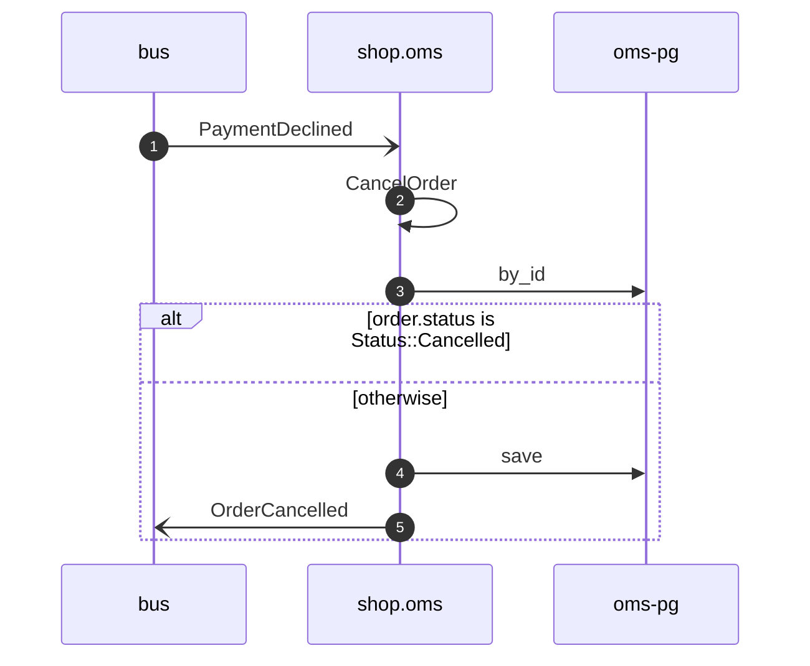

# Cancel order on payment declined

*Generated from the portolan catalog. Do not edit by hand.*

- **Id:** `flow.oms-cancel-order-on-payment-declined`
- **Owner:** [shop](../shop/README.md)
- **Trigger:** `event` · PaymentDeclined
- **Root confidence:** high
- **Source:** [`examples/shop/oms/src/application/policy/cancel_order_on_payment_declined.rs`](https://github.com/shortlink-org/portolan/blob/main/examples/shop/oms/src/application/policy/cancel_order_on_payment_declined.rs)

Cancels the order whose payment ledger declined (ADR oms.0007). The same fact heard twice, or after the RPC answer already cancelled, changes nothing.

## Participants

| Participant | Kind | Context | Entity |
| --- | --- | --- | --- |
| `bus` | broker | — | — |
| `shop.oms` | service | [shop](../shop/README.md) | — |
| `oms-pg` | store | [shop](../shop/README.md) | [shop.oms.pg](../shop/oms/stores/pg.md) |

## Sequence

## Steps

1. **bus** → **shop.oms** — PaymentDeclined
   [`payments.ledger.payment.PaymentDeclined`](../payments/ledger/aggregates/payment.md#event-payments-ledger-payment-paymentdeclined) · status: declared · [`examples/shop/oms/src/application/policy/cancel_order_on_payment_declined.rs:17`](https://github.com/shortlink-org/portolan/blob/main/examples/shop/oms/src/application/policy/cancel_order_on_payment_declined.rs#L17)

2. **shop.oms** ↺ **shop.oms** — CancelOrder
   `shop.oms.order/CancelOrder` · status: declared · [`examples/shop/oms/src/application/policy/cancel_order_on_payment_declined.rs:18`](https://github.com/shortlink-org/portolan/blob/main/examples/shop/oms/src/application/policy/cancel_order_on_payment_declined.rs#L18)

3. **shop.oms** → **oms-pg** — by_id
   status: declared · [`examples/shop/oms/src/application/order/usecases/cancel_order/mod.rs:35`](https://github.com/shortlink-org/portolan/blob/main/examples/shop/oms/src/application/order/usecases/cancel_order/mod.rs#L35)

> **One of**
>
> *order.status is Status::Cancelled — *ends the flow**
>
>
> *otherwise*
>
> 
> 4. **shop.oms** → **oms-pg** — save
>    status: declared · [`examples/shop/oms/src/application/order/usecases/cancel_order/mod.rs:50`](https://github.com/shortlink-org/portolan/blob/main/examples/shop/oms/src/application/order/usecases/cancel_order/mod.rs#L50)
> 
> 5. **shop.oms** → **bus** — OrderCancelled
>    [`shop.oms.order.OrderCancelled`](../shop/oms/aggregates/order.md#event-shop-oms-order-ordercancelled) · status: declared · [`examples/shop/oms/src/application/order/usecases/cancel_order/mod.rs:50`](https://github.com/shortlink-org/portolan/blob/main/examples/shop/oms/src/application/order/usecases/cancel_order/mod.rs#L50)
