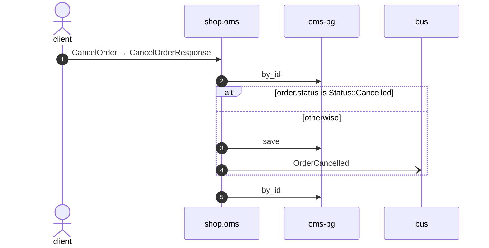

# Cancel order

*Generated from the portolan catalog. Do not edit by hand.*

- **Id:** `flow.oms-cancel-order`
- **Owner:** [shop](../shop/README.md)
- **Source:** [`examples/shop/oms/src/infrastructure/transport/grpc/order/handlers.rs`](https://github.com/shortlink-org/portolan/blob/main/examples/shop/oms/src/infrastructure/transport/grpc/order/handlers.rs)

Reads one order by id.

## Participants

| Participant | Kind | Context |
| --- | --- | --- |
| `client` | actor | — |
| `shop.oms` | service | [shop](../shop/README.md) |
| `oms-pg` | store | [shop](../shop/README.md) |
| `bus` | broker | — |

## Sequence

## Steps

1. **client** → **shop.oms** — CancelOrder → CancelOrderResponse
   [`examples/shop/oms/src/infrastructure/transport/grpc/order/handlers.rs:41`](https://github.com/shortlink-org/portolan/blob/main/examples/shop/oms/src/infrastructure/transport/grpc/order/handlers.rs#L41) · Seen running in telemetry/traces.jsonl (1 trace).

2. **shop.oms** → **oms-pg** — by_id
   status: declared · [`examples/shop/oms/src/application/order/usecases/cancel_order/mod.rs:21`](https://github.com/shortlink-org/portolan/blob/main/examples/shop/oms/src/application/order/usecases/cancel_order/mod.rs#L21)

> **One of**
>
> *order.status is Status::Cancelled — *ends the flow**
>
>
> *otherwise*
>
> 
> 3. **shop.oms** → **oms-pg** — save
>    status: declared · [`examples/shop/oms/src/application/order/usecases/cancel_order/mod.rs:26`](https://github.com/shortlink-org/portolan/blob/main/examples/shop/oms/src/application/order/usecases/cancel_order/mod.rs#L26)
> 
> 4. **shop.oms** → **bus** — OrderCancelled
>    [`shop.oms.order.OrderCancelled`](../shop/oms/aggregates/order.md#event-shop-oms-order-ordercancelled) · [`examples/shop/oms/src/application/order/usecases/cancel_order/mod.rs:26`](https://github.com/shortlink-org/portolan/blob/main/examples/shop/oms/src/application/order/usecases/cancel_order/mod.rs#L26) · Seen running in telemetry/traces.jsonl (1 trace).

5. **shop.oms** → **oms-pg** — by_id
   status: declared · [`examples/shop/oms/src/application/order/usecases/get_order/mod.rs:42`](https://github.com/shortlink-org/portolan/blob/main/examples/shop/oms/src/application/order/usecases/get_order/mod.rs#L42)

## Recordings

Traces this flow was seen running in, kept as examples: which steps ran, how long each took, and the names the spans carried.

- **Recording:** [`examples/shop/oms/telemetry/traces.jsonl`](https://github.com/shortlink-org/portolan/blob/main/examples/shop/oms/telemetry/traces.jsonl)
- **Trace:** `b23aa3f8bb39a65d8b5000d5741081aa`
- **Recorded:** 2026-09-04T19:48:30.544095Z
- **Duration:** 6.374 ms

| Step | Span | Duration | Attributes |
| --- | --- | --- | --- |
| [s1](oms-cancel-order.md#step-s1) | `shop.v1.OrderService/CancelOrder` | 6.374 ms | `rpc.method=CancelOrder` `rpc.service=shop.v1.OrderService` `rpc.system=grpc` |
| [s4](oms-cancel-order.md#step-s4) | `publish oms.OrderCancelled` | 0.285 ms | `event.name=oms.OrderCancelled` `messaging.destination.name=shop.oms.order` `messaging.operation.type=publish` `messaging.system=outbox` |
