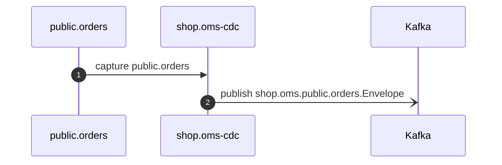

# oms-cdc · public.orders · CDC

*Generated from the portolan catalog. Do not edit by hand.*

- **Id:** `shop.oms-cdc.oms-cdc-public-orders-shop-oms-public-orders-shop-oms-public-orders-envelope`
- **Owner:** [shop](../shop/README.md)
- **Trigger:** `startup` · Kafka Connect task
- **Root confidence:** high
- **Source:** [`examples/shop/oms/connectors/oms-cdc.yaml:1`](https://github.com/shortlink-org/portolan/blob/main/examples/shop/oms/connectors/oms-cdc.yaml#L1)

Debezium captures public.orders and relays it to Kafka from the connector configuration.

## Participants

| Participant | Kind | Context | Entity | Label |
| --- | --- | --- | --- | --- |
| `oms-cdc-source` | store | [shop](../shop/README.md) | [shop.oms.pg](../shop/oms/stores/pg.md) | public.orders |
| `shop.oms-cdc` | service | [shop](../shop/README.md) | [shop.oms-cdc](../shop/oms-cdc/README.md) | — |
| `oms-cdc-kafka` | broker | — | — | Kafka |

## Sequence

## Steps

1. **oms-cdc-source** → **shop.oms-cdc** — capture public.orders
   status: declared · [`examples/shop/oms/connectors/oms-cdc.yaml:1`](https://github.com/shortlink-org/portolan/blob/main/examples/shop/oms/connectors/oms-cdc.yaml#L1) · The connector configuration declares this table in table.include.list. · evidence: configuration · debezium-table-include · `public.orders` · [`examples/shop/oms/connectors/oms-cdc.yaml:1`](https://github.com/shortlink-org/portolan/blob/main/examples/shop/oms/connectors/oms-cdc.yaml#L1)

2. **shop.oms-cdc** → **oms-cdc-kafka** — publish shop.oms.public.orders.Envelope
   status: declared · [`examples/shop/oms/connectors/oms-cdc.yaml:1`](https://github.com/shortlink-org/portolan/blob/main/examples/shop/oms/connectors/oms-cdc.yaml#L1) · handoff: send · message · kafka · shop.oms.public.orders · shop.oms.public.orders.Envelope · evidence: configuration · debezium-default-topic · `shop.oms.public.orders` · [`examples/shop/oms/connectors/oms-cdc.yaml:1`](https://github.com/shortlink-org/portolan/blob/main/examples/shop/oms/connectors/oms-cdc.yaml#L1)
