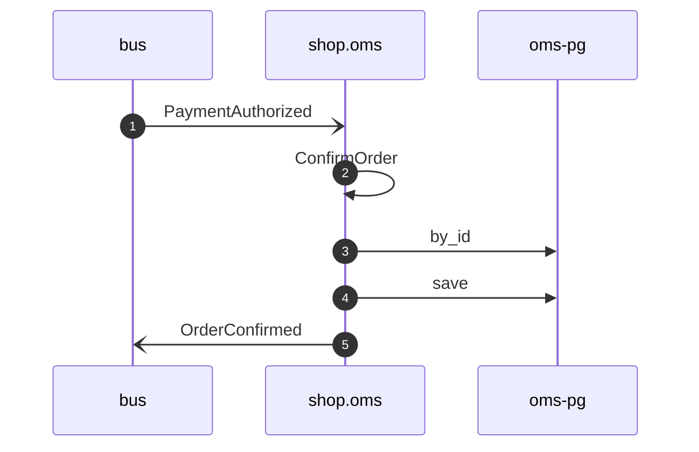

# Confirm order on payment authorized

*Generated from the portolan catalog. Do not edit by hand.*

- **Id:** `flow.oms-confirm-order-on-payment-authorized`
- **Owner:** [shop](../shop/README.md)
- **Trigger:** `event` · PaymentAuthorized
- **Root confidence:** high
- **Source:** [`examples/shop/oms/src/application/policy/confirm_order_on_payment_authorized.rs`](https://github.com/shortlink-org/portolan/blob/main/examples/shop/oms/src/application/policy/confirm_order_on_payment_authorized.rs)

Applies the ledger's public fact; it never calls Authorize.

## Participants

| Participant | Kind | Context | Entity |
| --- | --- | --- | --- |
| `bus` | broker | — | — |
| `shop.oms` | service | [shop](../shop/README.md) | — |
| `oms-pg` | store | [shop](../shop/README.md) | [shop.oms.pg](../shop/oms/stores/pg.md) |

## Sequence

## Steps

1. **bus** → **shop.oms** — PaymentAuthorized
   [`payments.ledger.payment.PaymentAuthorized`](../payments/ledger/aggregates/payment.md#event-payments-ledger-payment-paymentauthorized) · status: declared · [`examples/shop/oms/src/application/policy/confirm_order_on_payment_authorized.rs:16`](https://github.com/shortlink-org/portolan/blob/main/examples/shop/oms/src/application/policy/confirm_order_on_payment_authorized.rs#L16)

2. **shop.oms** ↺ **shop.oms** — ConfirmOrder
   `shop.oms.order/ConfirmOrder` · status: declared · [`examples/shop/oms/src/application/policy/confirm_order_on_payment_authorized.rs:17`](https://github.com/shortlink-org/portolan/blob/main/examples/shop/oms/src/application/policy/confirm_order_on_payment_authorized.rs#L17)

3. **shop.oms** → **oms-pg** — by_id
   status: declared · [`examples/shop/oms/src/application/order/usecases/confirm_order/mod.rs:26`](https://github.com/shortlink-org/portolan/blob/main/examples/shop/oms/src/application/order/usecases/confirm_order/mod.rs#L26)

4. **shop.oms** → **oms-pg** — save
   status: declared · [`examples/shop/oms/src/application/order/usecases/confirm_order/mod.rs:38`](https://github.com/shortlink-org/portolan/blob/main/examples/shop/oms/src/application/order/usecases/confirm_order/mod.rs#L38)

5. **shop.oms** → **bus** — OrderConfirmed
   [`shop.oms.order.OrderConfirmed`](../shop/oms/aggregates/order.md#event-shop-oms-order-orderconfirmed) · status: declared · [`examples/shop/oms/src/application/order/usecases/confirm_order/mod.rs:38`](https://github.com/shortlink-org/portolan/blob/main/examples/shop/oms/src/application/order/usecases/confirm_order/mod.rs#L38)
