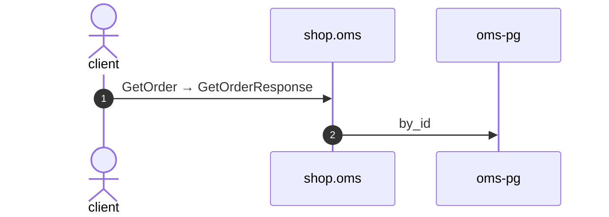

# Get order

*Generated from the portolan catalog. Do not edit by hand.*

- **Id:** `flow.oms-get-order`
- **Owner:** [shop](../shop/README.md)
- **Trigger:** `callback` · gRPC · GetOrder
- **Root confidence:** high
- **Source:** [`examples/shop/oms/src/infrastructure/transport/grpc/order/handlers.rs`](https://github.com/shortlink-org/portolan/blob/main/examples/shop/oms/src/infrastructure/transport/grpc/order/handlers.rs)

Reads one order by id.

## Participants

| Participant | Kind | Context | Entity |
| --- | --- | --- | --- |
| `client` | actor | — | — |
| `shop.oms` | service | [shop](../shop/README.md) | — |
| `oms-pg` | store | [shop](../shop/README.md) | [shop.oms.pg](../shop/oms/stores/pg.md) |

## Sequence

## Steps

1. **client** → **shop.oms** — GetOrder → GetOrderResponse
   `shop.v1.OrderService/GetOrder` · status: declared · [`examples/shop/oms/src/infrastructure/transport/grpc/order/handlers.rs:31`](https://github.com/shortlink-org/portolan/blob/main/examples/shop/oms/src/infrastructure/transport/grpc/order/handlers.rs#L31)

2. **shop.oms** → **oms-pg** — by_id
   status: declared · [`examples/shop/oms/src/application/order/usecases/get_order/mod.rs:42`](https://github.com/shortlink-org/portolan/blob/main/examples/shop/oms/src/application/order/usecases/get_order/mod.rs#L42)
