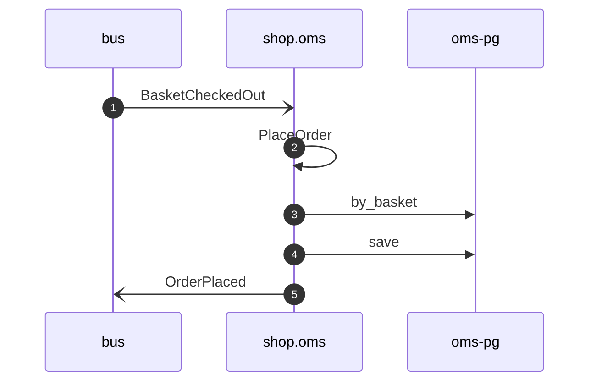

# Place order on basket checked out

*Generated from the portolan catalog. Do not edit by hand.*

- **Id:** `flow.oms-place-order-on-basket-checked-out`
- **Owner:** [shop](../shop/README.md)
- **Source:** [`examples/shop/oms/src/application/policy/place_order_on_basket_checked_out.rs`](https://github.com/shortlink-org/portolan/blob/main/examples/shop/oms/src/application/policy/place_order_on_basket_checked_out.rs)

Places the order the basket was checked out for (ADR oms.0002). The order takes the basket's id, so the same checkout heard twice places one order.

## Participants

| Participant | Kind | Context |
| --- | --- | --- |
| `bus` | broker | — |
| `shop.oms` | service | [shop](../shop/README.md) |
| `oms-pg` | store | [shop](../shop/README.md) |

## Sequence

## Steps

1. **bus** → **shop.oms** — BasketCheckedOut
   [`shop.cart.basket.BasketCheckedOut`](../shop/cart/aggregates/basket.md#event-shop-cart-basket-basketcheckedout) · [`examples/shop/oms/src/application/policy/place_order_on_basket_checked_out.rs:19`](https://github.com/shortlink-org/portolan/blob/main/examples/shop/oms/src/application/policy/place_order_on_basket_checked_out.rs#L19) · Seen running in telemetry/traces.jsonl (1 trace).

2. **shop.oms** ↺ **shop.oms** — PlaceOrder
   status: declared · [`examples/shop/oms/src/application/policy/place_order_on_basket_checked_out.rs:29`](https://github.com/shortlink-org/portolan/blob/main/examples/shop/oms/src/application/policy/place_order_on_basket_checked_out.rs#L29)

3. **shop.oms** → **oms-pg** — by_basket
   status: declared · [`examples/shop/oms/src/application/order/usecases/place_order/mod.rs:27`](https://github.com/shortlink-org/portolan/blob/main/examples/shop/oms/src/application/order/usecases/place_order/mod.rs#L27)

4. **shop.oms** → **oms-pg** — save
   status: declared · [`examples/shop/oms/src/application/order/usecases/place_order/mod.rs:31`](https://github.com/shortlink-org/portolan/blob/main/examples/shop/oms/src/application/order/usecases/place_order/mod.rs#L31)

5. **shop.oms** → **bus** — OrderPlaced
   [`shop.oms.order.OrderPlaced`](../shop/oms/aggregates/order.md#event-shop-oms-order-orderplaced) · [`examples/shop/oms/src/application/order/usecases/place_order/mod.rs:31`](https://github.com/shortlink-org/portolan/blob/main/examples/shop/oms/src/application/order/usecases/place_order/mod.rs#L31) · Seen running in telemetry/traces.jsonl (1 trace).

## Recordings

Traces this flow was seen running in, kept as examples: which steps ran, how long each took, and the names the spans carried.

- **Recording:** [`examples/shop/oms/telemetry/traces.jsonl`](https://github.com/shortlink-org/portolan/blob/main/examples/shop/oms/telemetry/traces.jsonl)
- **Trace:** `9fa8b3540bf975f37448bdd06ea893f2`
- **Recorded:** 2026-09-04T19:48:27.103931Z
- **Duration:** 25.826 ms

| Step | Span | Duration | Attributes |
| --- | --- | --- | --- |
| [s1](oms-place-order-on-basket-checked-out.md#step-s1) | `consume cart.BasketCheckedOut` | 25.826 ms | `event.name=cart.BasketCheckedOut` `messaging.destination.name=shop.cart.basket` `messaging.operation.type=process` `messaging.system=nats` |
| [s5](oms-place-order-on-basket-checked-out.md#step-s5) | `publish oms.OrderPlaced` | 0.766 ms | `event.name=oms.OrderPlaced` `messaging.destination.name=shop.oms.order` `messaging.operation.type=publish` `messaging.system=outbox` |
