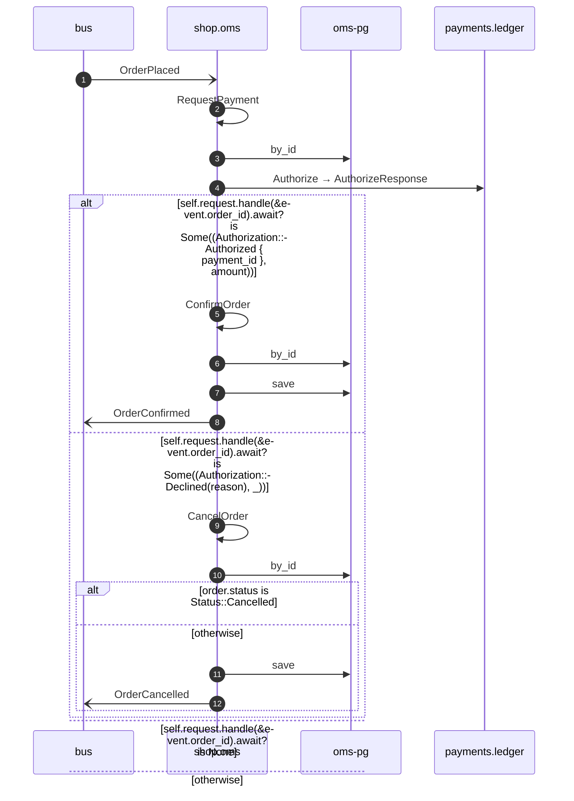

# Request payment on order placed

*Generated from the portolan catalog. Do not edit by hand.*

- **Id:** `flow.oms-request-payment-on-order-placed`
- **Owner:** [shop](../shop/README.md)
- **Trigger:** `event` · OrderPlaced
- **Root confidence:** high
- **Source:** [`examples/shop/oms/src/application/policy/request_payment_on_order_placed.rs`](https://github.com/shortlink-org/portolan/blob/main/examples/shop/oms/src/application/policy/request_payment_on_order_placed.rs)

The stored OrderPlaced triggers the RPC. Applying its answer also recovers a ledger save whose subsequent event publication failed.

## Participants

| Participant | Kind | Context | Entity |
| --- | --- | --- | --- |
| `bus` | broker | — | — |
| `shop.oms` | service | [shop](../shop/README.md) | — |
| `oms-pg` | store | [shop](../shop/README.md) | [shop.oms.pg](../shop/oms/stores/pg.md) |
| `payments.ledger` | service | [payments](../payments/README.md) | — |

## Sequence

## Steps

1. **bus** → **shop.oms** — OrderPlaced
   [`shop.oms.order.OrderPlaced`](../shop/oms/aggregates/order.md#event-shop-oms-order-orderplaced) · status: declared · [`examples/shop/oms/src/application/policy/request_payment_on_order_placed.rs:28`](https://github.com/shortlink-org/portolan/blob/main/examples/shop/oms/src/application/policy/request_payment_on_order_placed.rs#L28)

2. **shop.oms** ↺ **shop.oms** — RequestPayment
   `shop.oms.order/RequestPayment` · status: declared · [`examples/shop/oms/src/application/policy/request_payment_on_order_placed.rs:29`](https://github.com/shortlink-org/portolan/blob/main/examples/shop/oms/src/application/policy/request_payment_on_order_placed.rs#L29)

3. **shop.oms** → **oms-pg** — by_id
   status: declared · [`examples/shop/oms/src/application/order/usecases/request_payment/mod.rs:49`](https://github.com/shortlink-org/portolan/blob/main/examples/shop/oms/src/application/order/usecases/request_payment/mod.rs#L49)

4. **shop.oms** → **payments.ledger** — Authorize → AuthorizeResponse
   `payments.v1.PaymentService/Authorize` · status: declared · [`examples/shop/oms/src/application/order/usecases/request_payment/mod.rs:53`](https://github.com/shortlink-org/portolan/blob/main/examples/shop/oms/src/application/order/usecases/request_payment/mod.rs#L53)

> **One of**
>
> *self.request.handle(&event.order_id).await? is Some((Authorization::Authorized { payment_id }, amount))*
>
> 
> 5. **shop.oms** ↺ **shop.oms** — ConfirmOrder
>    `shop.oms.order/ConfirmOrder` · status: declared · [`examples/shop/oms/src/application/policy/request_payment_on_order_placed.rs:31`](https://github.com/shortlink-org/portolan/blob/main/examples/shop/oms/src/application/policy/request_payment_on_order_placed.rs#L31)
> 
> 6. **shop.oms** → **oms-pg** — by_id
>    status: declared · [`examples/shop/oms/src/application/order/usecases/confirm_order/mod.rs:26`](https://github.com/shortlink-org/portolan/blob/main/examples/shop/oms/src/application/order/usecases/confirm_order/mod.rs#L26)
> 
> 7. **shop.oms** → **oms-pg** — save
>    status: declared · [`examples/shop/oms/src/application/order/usecases/confirm_order/mod.rs:38`](https://github.com/shortlink-org/portolan/blob/main/examples/shop/oms/src/application/order/usecases/confirm_order/mod.rs#L38)
> 
> 8. **shop.oms** → **bus** — OrderConfirmed
>    [`shop.oms.order.OrderConfirmed`](../shop/oms/aggregates/order.md#event-shop-oms-order-orderconfirmed) · status: declared · [`examples/shop/oms/src/application/order/usecases/confirm_order/mod.rs:38`](https://github.com/shortlink-org/portolan/blob/main/examples/shop/oms/src/application/order/usecases/confirm_order/mod.rs#L38)
>
> *self.request.handle(&event.order_id).await? is Some((Authorization::Declined(reason), _))*
>
> 
> 9. **shop.oms** ↺ **shop.oms** — CancelOrder
>    `shop.oms.order/CancelOrder` · status: declared · [`examples/shop/oms/src/application/policy/request_payment_on_order_placed.rs:43`](https://github.com/shortlink-org/portolan/blob/main/examples/shop/oms/src/application/policy/request_payment_on_order_placed.rs#L43)
> 
> 10. **shop.oms** → **oms-pg** — by_id
>    status: declared · [`examples/shop/oms/src/application/order/usecases/cancel_order/mod.rs:35`](https://github.com/shortlink-org/portolan/blob/main/examples/shop/oms/src/application/order/usecases/cancel_order/mod.rs#L35)
>
> > **One of**
> >
> > *order.status is Status::Cancelled — *ends the flow**
> >
> >
> > *otherwise*
> >
> > 
> > 11. **shop.oms** → **oms-pg** — save
> >    status: declared · [`examples/shop/oms/src/application/order/usecases/cancel_order/mod.rs:50`](https://github.com/shortlink-org/portolan/blob/main/examples/shop/oms/src/application/order/usecases/cancel_order/mod.rs#L50)
> > 
> > 12. **shop.oms** → **bus** — OrderCancelled
> >    [`shop.oms.order.OrderCancelled`](../shop/oms/aggregates/order.md#event-shop-oms-order-ordercancelled) · status: declared · [`examples/shop/oms/src/application/order/usecases/cancel_order/mod.rs:50`](https://github.com/shortlink-org/portolan/blob/main/examples/shop/oms/src/application/order/usecases/cancel_order/mod.rs#L50)
>
>
> *self.request.handle(&event.order_id).await? is None*
>
>
> *otherwise*
