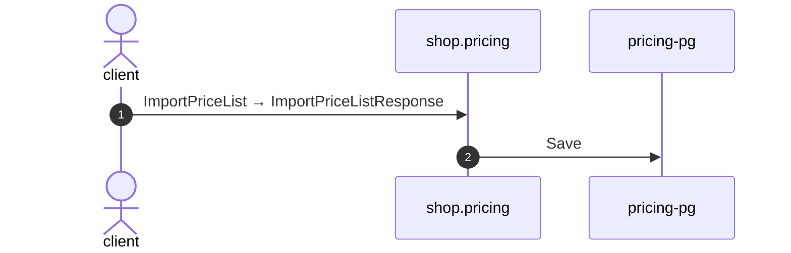

# Import price list

*Generated from the portolan catalog. Do not edit by hand.*

- **Id:** `flow.pricing-import-price-list`
- **Owner:** [shop](../shop/README.md)
- **Trigger:** `callback` · gRPC · ImportPriceList
- **Root confidence:** high
- **Source:** [`examples/shop/pricing/internal/infrastructure/transport/grpc/price_list/handler.go`](https://github.com/shortlink-org/portolan/blob/main/examples/shop/pricing/internal/infrastructure/transport/grpc/price_list/handler.go)

Package import_price_list takes in a whole price list.

## Participants

| Participant | Kind | Context | Entity |
| --- | --- | --- | --- |
| `client` | actor | — | — |
| `shop.pricing` | service | [shop](../shop/README.md) | — |
| `pricing-pg` | store | [shop](../shop/README.md) | [shop.pricing.pg](../shop/pricing/stores/pg.md) |

## Sequence

## Steps

1. **client** → **shop.pricing** — ImportPriceList → ImportPriceListResponse
   `shop.v1.PriceLists/ImportPriceList` · status: declared · [`examples/shop/pricing/internal/infrastructure/transport/grpc/price_list/handler.go:30`](https://github.com/shortlink-org/portolan/blob/main/examples/shop/pricing/internal/infrastructure/transport/grpc/price_list/handler.go#L30) · evidence: call-site · source-expression · `ImportPriceList` · [`examples/shop/pricing/internal/infrastructure/transport/grpc/price_list/handler.go:30`](https://github.com/shortlink-org/portolan/blob/main/examples/shop/pricing/internal/infrastructure/transport/grpc/price_list/handler.go#L30)

2. **shop.pricing** → **pricing-pg** — Save
   status: declared · [`examples/shop/pricing/internal/application/price_list/usecases/import_price_list/usecase.go:43`](https://github.com/shortlink-org/portolan/blob/main/examples/shop/pricing/internal/application/price_list/usecases/import_price_list/usecase.go#L43) · store: [shop.pricing.pg](../shop/pricing/stores/pg.md) · `Save` · evidence: function · source-function · `examples/shop/pricing/internal/application/price_list/usecases/import_price_list:UseCase.Handle` · [`examples/shop/pricing/internal/application/price_list/usecases/import_price_list/usecase.go:24`](https://github.com/shortlink-org/portolan/blob/main/examples/shop/pricing/internal/application/price_list/usecases/import_price_list/usecase.go#L24) · evidence: binding · domain-port-convention · `price_list.Repository` · [`examples/shop/pricing/internal/application/price_list/usecases/import_price_list/usecase.go:43`](https://github.com/shortlink-org/portolan/blob/main/examples/shop/pricing/internal/application/price_list/usecases/import_price_list/usecase.go#L43) · evidence: call-site · source-expression · `Save` · [`examples/shop/pricing/internal/application/price_list/usecases/import_price_list/usecase.go:43`](https://github.com/shortlink-org/portolan/blob/main/examples/shop/pricing/internal/application/price_list/usecases/import_price_list/usecase.go#L43)
