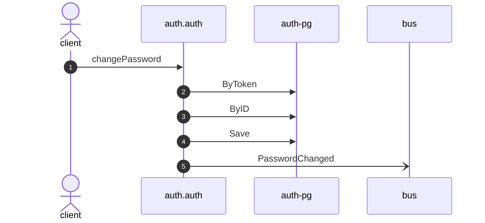

# Change password

*Generated from the portolan catalog · commit `4 sources` · at 2026-08-29T09:14:22Z. Do not edit by hand.*

- **Id:** `flow.auth-change-password`
- **Owner:** [auth](../auth/README.md)
- **Source:** `examples/auth/internal/infrastructure/transport/http/user/change_password.go`

Replaces the password of a user, given the current one.

## Participants

| Participant | Kind | Context |
| --- | --- | --- |
| `client` | actor | — |
| `auth.auth` | service | [auth](../auth/README.md) |
| `auth-pg` | store | [auth](../auth/README.md) |
| `bus` | broker | — |

## Sequence

## Steps

1. **client** → **auth.auth** — changePassword
   `examples/auth/internal/infrastructure/transport/http/user/change_password.go:20` · Seen running in telemetry/traces.jsonl (1 trace).
2. **auth.auth** → **auth-pg** — ByToken
   status: declared · `examples/auth/internal/application/session/usecases/validate/usecase.go:34`
3. **auth.auth** → **auth-pg** — ByID
   status: declared · `examples/auth/internal/application/user/usecases/change_password/usecase.go:31`
4. **auth.auth** → **auth-pg** — Save
   status: declared · `examples/auth/internal/application/user/usecases/change_password/usecase.go:40`
5. **auth.auth** → **bus** — PasswordChanged
   [auth.auth.user.PasswordChanged](../auth/auth/aggregates/user.md) · `examples/auth/internal/application/user/usecases/change_password/usecase.go:40` · Seen running in telemetry/traces.jsonl (1 trace).
