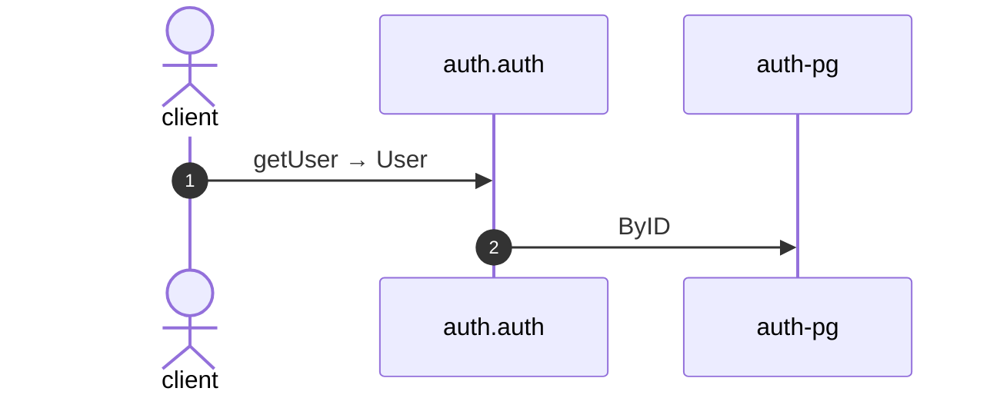

# Get user

*Generated from the portolan catalog · commit `11 sources` · at 2026-09-05T13:47:23+07:00. Do not edit by hand.*

- **Id:** `flow.auth-get-user`
- **Owner:** [auth](../auth/README.md)
- **Source:** [`examples/auth/internal/infrastructure/transport/http/user/get.go`](https://github.com/shortlink-org/portolan/blob/main/examples/auth/internal/infrastructure/transport/http/user/get.go)

Reads a user by id.

## Participants

| Participant | Kind | Context |
| --- | --- | --- |
| `client` | actor | — |
| `auth.auth` | service | [auth](../auth/README.md) |
| `auth-pg` | store | [auth](../auth/README.md) |

## Sequence

## Steps

1. **client** → **auth.auth** — getUser → User
   [`examples/auth/internal/infrastructure/transport/http/user/get.go:11`](https://github.com/shortlink-org/portolan/blob/main/examples/auth/internal/infrastructure/transport/http/user/get.go#L11) · Seen running in telemetry/traces.jsonl (3 traces).

2. **auth.auth** → **auth-pg** — ByID
   status: declared · [`examples/auth/internal/application/user/usecases/get/usecase.go:23`](https://github.com/shortlink-org/portolan/blob/main/examples/auth/internal/application/user/usecases/get/usecase.go#L23)
