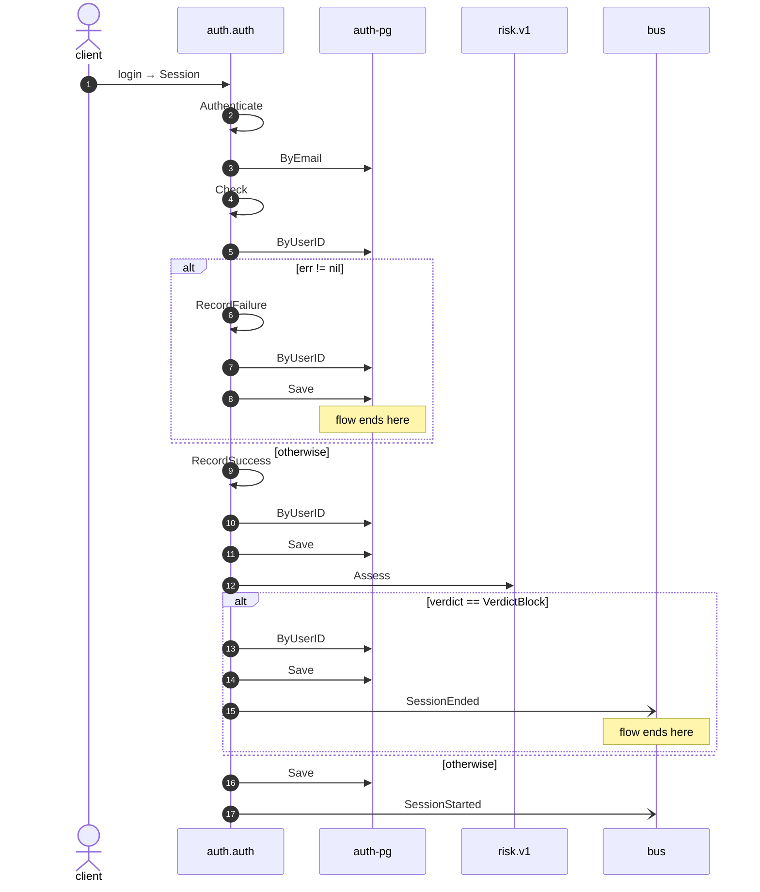

# Login

*Generated from the portolan catalog · commit `9 sources` · at 2026-09-05T13:47:23+07:00. Do not edit by hand.*

- **Id:** `flow.auth-login`
- **Owner:** [auth](../auth/README.md)
- **Source:** [`examples/auth/internal/infrastructure/transport/http/session/login.go`](https://github.com/shortlink-org/portolan/blob/main/examples/auth/internal/infrastructure/transport/http/session/login.go)

Turns credentials into a session.

## Participants

| Participant | Kind | Context | Label |
| --- | --- | --- | --- |
| `client` | actor | — | — |
| `auth.auth` | service | [auth](../auth/README.md) | — |
| `auth-pg` | store | [auth](../auth/README.md) | — |
| `risk-v1` | unknown | — | risk.v1 |
| `bus` | broker | — | — |

## Sequence

## Steps

1. **client** → **auth.auth** — login → Session
   [`examples/auth/internal/infrastructure/transport/http/session/login.go:11`](https://github.com/shortlink-org/portolan/blob/main/examples/auth/internal/infrastructure/transport/http/session/login.go#L11) · Seen running in telemetry/traces.jsonl (2 traces).

2. **auth.auth** ↺ **auth.auth** — Authenticate
   status: declared · [`examples/auth/internal/application/session/usecases/login/usecase.go:58`](https://github.com/shortlink-org/portolan/blob/main/examples/auth/internal/application/session/usecases/login/usecase.go#L58) · Port `Authenticator`, bound at assembly to the Authenticate use case.

3. **auth.auth** → **auth-pg** — ByEmail
   status: declared · [`examples/auth/internal/application/user/usecases/authenticate/usecase.go:41`](https://github.com/shortlink-org/portolan/blob/main/examples/auth/internal/application/user/usecases/authenticate/usecase.go#L41)

4. **auth.auth** ↺ **auth.auth** — Check
   status: declared · [`examples/auth/internal/application/user/usecases/authenticate/usecase.go:49`](https://github.com/shortlink-org/portolan/blob/main/examples/auth/internal/application/user/usecases/authenticate/usecase.go#L49) · Port `Lockout`, bound at assembly to the Check use case.

5. **auth.auth** → **auth-pg** — ByUserID
   status: declared · [`examples/auth/internal/application/lockout/usecases/check/usecase.go:27`](https://github.com/shortlink-org/portolan/blob/main/examples/auth/internal/application/lockout/usecases/check/usecase.go#L27)

> **One of**
>
> *err != nil — *ends the flow**
>
> 
> 6. **auth.auth** ↺ **auth.auth** — RecordFailure
>    status: declared · [`examples/auth/internal/application/user/usecases/authenticate/usecase.go:58`](https://github.com/shortlink-org/portolan/blob/main/examples/auth/internal/application/user/usecases/authenticate/usecase.go#L58) · Port `Lockout`, bound at assembly to the RecordFailure use case.
> 
> 7. **auth.auth** → **auth-pg** — ByUserID
>    status: declared · [`examples/auth/internal/application/lockout/usecases/record_failure/usecase.go:37`](https://github.com/shortlink-org/portolan/blob/main/examples/auth/internal/application/lockout/usecases/record_failure/usecase.go#L37) · inside a loop over `retries`.
> 
> 8. **auth.auth** → **auth-pg** — Save
>    status: declared · [`examples/auth/internal/application/lockout/usecases/record_failure/usecase.go:54`](https://github.com/shortlink-org/portolan/blob/main/examples/auth/internal/application/lockout/usecases/record_failure/usecase.go#L54) · inside a loop over `retries`.
>
> *otherwise*

9. **auth.auth** ↺ **auth.auth** — RecordSuccess
   status: declared · [`examples/auth/internal/application/user/usecases/authenticate/usecase.go:67`](https://github.com/shortlink-org/portolan/blob/main/examples/auth/internal/application/user/usecases/authenticate/usecase.go#L67) · Port `Lockout`, bound at assembly to the RecordSuccess use case.

10. **auth.auth** → **auth-pg** — ByUserID
   status: declared · [`examples/auth/internal/application/lockout/usecases/record_success/usecase.go:32`](https://github.com/shortlink-org/portolan/blob/main/examples/auth/internal/application/lockout/usecases/record_success/usecase.go#L32) · inside a loop over `retries`.

11. **auth.auth** → **auth-pg** — Save
   status: declared · [`examples/auth/internal/application/lockout/usecases/record_success/usecase.go:44`](https://github.com/shortlink-org/portolan/blob/main/examples/auth/internal/application/lockout/usecases/record_success/usecase.go#L44) · inside a loop over `retries`.

12. **auth.auth** → **risk-v1** — Assess
   `risk.v1.RiskService/Assess` · status: unresolved · [`examples/auth/internal/application/session/usecases/login/usecase.go:63`](https://github.com/shortlink-org/portolan/blob/main/examples/auth/internal/application/session/usecases/login/usecase.go#L63)

> **One of**
>
> *verdict == VerdictBlock — *ends the flow**
>
> 
> 13. **auth.auth** → **auth-pg** — ByUserID
>    status: declared · [`examples/auth/internal/application/session/usecases/login/usecase.go:92`](https://github.com/shortlink-org/portolan/blob/main/examples/auth/internal/application/session/usecases/login/usecase.go#L92)
> 
> 14. **auth.auth** → **auth-pg** — Save
>    status: declared · [`examples/auth/internal/application/session/usecases/login/usecase.go:102`](https://github.com/shortlink-org/portolan/blob/main/examples/auth/internal/application/session/usecases/login/usecase.go#L102) · inside a loop over `sessions`.
> 
> 15. **auth.auth** → **bus** — SessionEnded
>    [`auth.auth.session.SessionEnded`](../auth/auth/aggregates/session.md#event-auth-auth-session-sessionended) · status: declared · [`examples/auth/internal/application/session/usecases/login/usecase.go:102`](https://github.com/shortlink-org/portolan/blob/main/examples/auth/internal/application/session/usecases/login/usecase.go#L102) · inside a loop over `sessions`.
>
> *otherwise*

16. **auth.auth** → **auth-pg** — Save
   status: declared · [`examples/auth/internal/application/session/usecases/login/usecase.go:78`](https://github.com/shortlink-org/portolan/blob/main/examples/auth/internal/application/session/usecases/login/usecase.go#L78)

17. **auth.auth** → **bus** — SessionStarted
   [`auth.auth.session.SessionStarted`](../auth/auth/aggregates/session.md#event-auth-auth-session-sessionstarted) · [`examples/auth/internal/application/session/usecases/login/usecase.go:78`](https://github.com/shortlink-org/portolan/blob/main/examples/auth/internal/application/session/usecases/login/usecase.go#L78) · Seen running in telemetry/traces.jsonl (2 traces).
