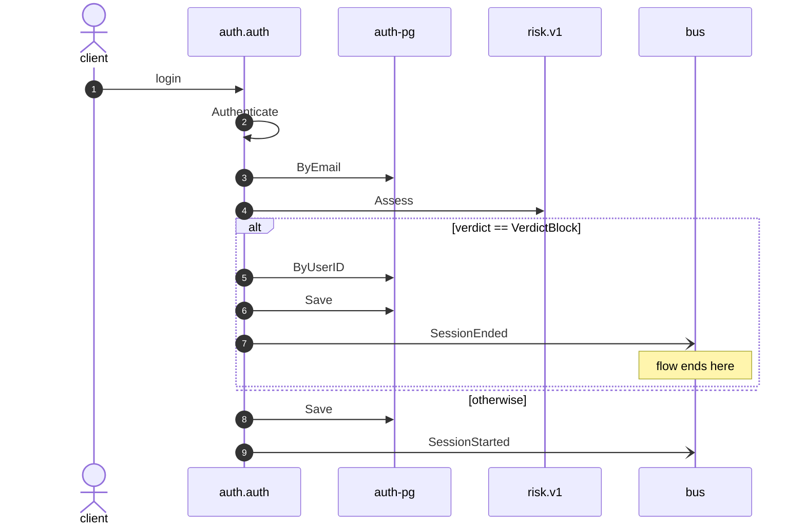

# Login

*Generated from the portolan catalog · commit `3 sources` · at 2026-08-29T09:14:22Z. Do not edit by hand.*

- **Id:** `flow.auth-login`
- **Owner:** [auth](../auth/README.md)
- **Source:** `examples/auth/internal/infrastructure/transport/http/session/login.go`

Turns credentials into a session.

## Participants

| Participant | Kind | Context | Label |
| --- | --- | --- | --- |
| `client` | actor | — | — |
| `auth.auth` | service | [auth](../auth/README.md) | — |
| `auth-pg` | store | [auth](../auth/README.md) | — |
| `risk-v1` | unknown | — | risk.v1 |
| `bus` | broker | — | — |

## Sequence

## Steps

1. **client** → **auth.auth** — login
   `examples/auth/internal/infrastructure/transport/http/session/login.go:11` · Seen running in telemetry/traces.jsonl (2 traces).
2. **auth.auth** ↺ **auth.auth** — Authenticate
   status: declared · `examples/auth/internal/application/session/usecases/login/usecase.go:58` · Port `Authenticator`, bound at assembly to the Authenticate use case.
3. **auth.auth** → **auth-pg** — ByEmail
   status: declared · `examples/auth/internal/application/user/usecases/authenticate/usecase.go:33`
4. **auth.auth** → **risk-v1** — Assess
   `risk.v1.RiskService/Assess` · status: unresolved · `examples/auth/internal/application/session/usecases/login/usecase.go:63`

> **One of**
>
> *verdict == VerdictBlock — *ends the flow**
>
> 5. **auth.auth** → **auth-pg** — ByUserID
>    status: declared · `examples/auth/internal/application/session/usecases/login/usecase.go:92`
> 6. **auth.auth** → **auth-pg** — Save
>    status: declared · `examples/auth/internal/application/session/usecases/login/usecase.go:102` · inside a loop over `sessions`.
> 7. **auth.auth** → **bus** — SessionEnded
>    [auth.auth.session.SessionEnded](../auth/auth/aggregates/session.md) · status: declared · `examples/auth/internal/application/session/usecases/login/usecase.go:102` · inside a loop over `sessions`.
>
> *otherwise*

8. **auth.auth** → **auth-pg** — Save
   status: declared · `examples/auth/internal/application/session/usecases/login/usecase.go:78`
9. **auth.auth** → **bus** — SessionStarted
   [auth.auth.session.SessionStarted](../auth/auth/aggregates/session.md) · `examples/auth/internal/application/session/usecases/login/usecase.go:78` · Seen running in telemetry/traces.jsonl (2 traces).
