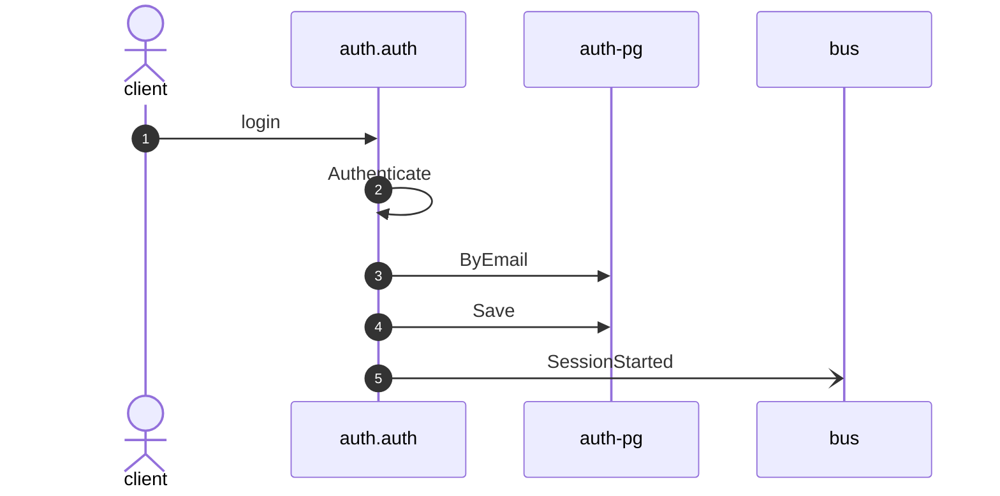

# Login

*Generated from the portolan catalog · commit `2 sources` · at 2026-08-29T09:14:22Z. Do not edit by hand.*

- **Id:** `flow.auth-login`
- **Owner:** [auth](../auth/README.md)
- **Source:** `examples/auth/internal/infrastructure/transport/http/session/login.go`

Turns credentials into a session.

## Participants

| Participant | Kind | Context |
| --- | --- | --- |
| `client` | actor | — |
| `auth.auth` | service | [auth](../auth/README.md) |
| `auth-pg` | store | [auth](../auth/README.md) |
| `bus` | broker | — |

## Sequence

## Steps

1. **client** → **auth.auth** — login
   status: declared · `examples/auth/internal/infrastructure/transport/http/session/login.go:11`
2. **auth.auth** ↺ **auth.auth** — Authenticate
   status: declared · `examples/auth/internal/application/session/usecases/login/usecase.go:49` · Port `Authenticator`, bound at assembly to the Authenticate use case.
3. **auth.auth** → **auth-pg** — ByEmail
   status: declared · `examples/auth/internal/application/user/usecases/authenticate/usecase.go:33`
4. **auth.auth** → **auth-pg** — Save
   status: declared · `examples/auth/internal/application/session/usecases/login/usecase.go:58`
5. **auth.auth** → **bus** — SessionStarted
   [auth.auth.session.SessionStarted](../auth/auth/aggregates/session.md) · status: declared · `examples/auth/internal/application/session/usecases/login/usecase.go:58`
