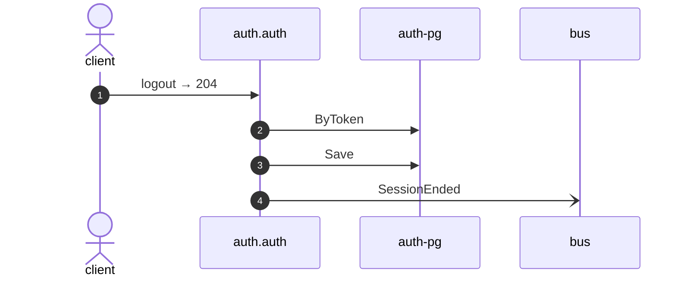

# Logout

*Generated from the portolan catalog · commit `11 sources` · at 2026-09-05T13:47:23+07:00. Do not edit by hand.*

- **Id:** `flow.auth-logout`
- **Owner:** [auth](../auth/README.md)
- **Source:** [`examples/auth/internal/infrastructure/transport/http/session/logout.go`](https://github.com/shortlink-org/portolan/blob/main/examples/auth/internal/infrastructure/transport/http/session/logout.go)

Ends the session behind a token.

## Participants

| Participant | Kind | Context |
| --- | --- | --- |
| `client` | actor | — |
| `auth.auth` | service | [auth](../auth/README.md) |
| `auth-pg` | store | [auth](../auth/README.md) |
| `bus` | broker | — |

## Sequence

## Steps

1. **client** → **auth.auth** — logout → 204
   [`examples/auth/internal/infrastructure/transport/http/session/logout.go:15`](https://github.com/shortlink-org/portolan/blob/main/examples/auth/internal/infrastructure/transport/http/session/logout.go#L15) · Seen running in telemetry/traces.jsonl (1 trace).

2. **auth.auth** → **auth-pg** — ByToken
   status: declared · [`examples/auth/internal/application/session/usecases/logout/usecase.go:35`](https://github.com/shortlink-org/portolan/blob/main/examples/auth/internal/application/session/usecases/logout/usecase.go#L35)

3. **auth.auth** → **auth-pg** — Save
   status: declared · [`examples/auth/internal/application/session/usecases/logout/usecase.go:49`](https://github.com/shortlink-org/portolan/blob/main/examples/auth/internal/application/session/usecases/logout/usecase.go#L49)

4. **auth.auth** → **bus** — SessionEnded
   [`auth.auth.session.SessionEnded`](../auth/auth/aggregates/session.md#event-auth-auth-session-sessionended) · [`examples/auth/internal/application/session/usecases/logout/usecase.go:49`](https://github.com/shortlink-org/portolan/blob/main/examples/auth/internal/application/session/usecases/logout/usecase.go#L49) · Seen running in telemetry/traces.jsonl (1 trace).
