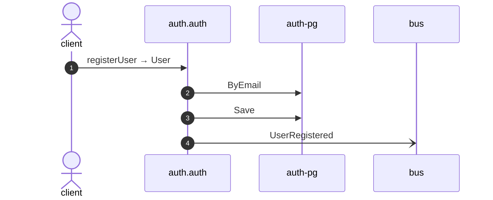

# Register user

*Generated from the portolan catalog · commit `5 sources` · at 2026-08-29T09:14:22Z. Do not edit by hand.*

- **Id:** `flow.auth-register-user`
- **Owner:** [auth](../auth/README.md)
- **Source:** `examples/auth/internal/infrastructure/transport/http/user/register.go`

Creates a user from an email address and a password.

## Participants

| Participant | Kind | Context |
| --- | --- | --- |
| `client` | actor | — |
| `auth.auth` | service | [auth](../auth/README.md) |
| `auth-pg` | store | [auth](../auth/README.md) |
| `bus` | broker | — |

## Sequence

## Steps

1. **client** → **auth.auth** — registerUser → User
   `examples/auth/internal/infrastructure/transport/http/user/register.go:16` · Seen running in telemetry/traces.jsonl (2 traces).
2. **auth.auth** → **auth-pg** — ByEmail
   status: declared · `examples/auth/internal/application/user/usecases/register/usecase.go:36`
3. **auth.auth** → **auth-pg** — Save
   status: declared · `examples/auth/internal/application/user/usecases/register/usecase.go:49`
4. **auth.auth** → **bus** — UserRegistered
   [auth.auth.user.UserRegistered](../auth/auth/aggregates/user.md) · `examples/auth/internal/application/user/usecases/register/usecase.go:49` · Seen running in telemetry/traces.jsonl (2 traces).
