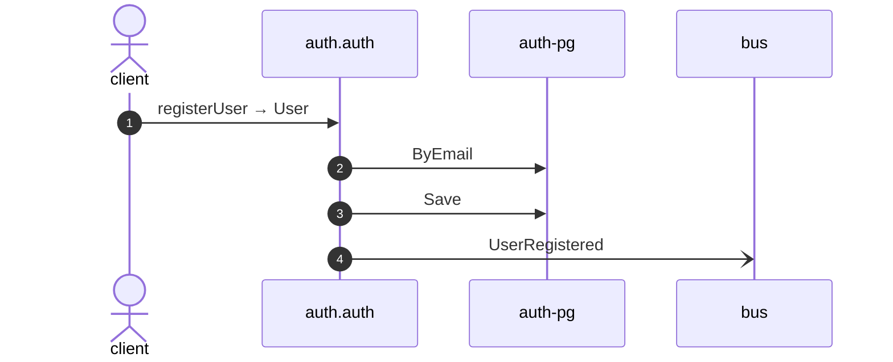

# Register user

*Generated from the portolan catalog · commit `13 sources` · at 2026-09-05T13:47:23+07:00. Do not edit by hand.*

- **Id:** `flow.auth-register-user`
- **Owner:** [auth](../auth/README.md)
- **Source:** [`examples/auth/internal/user/infrastructure/http/register.go`](https://github.com/shortlink-org/portolan/blob/main/examples/auth/internal/user/infrastructure/http/register.go)

Creates a user from an email address and a password.

## Participants

| Participant | Kind | Context |
| --- | --- | --- |
| `client` | actor | — |
| `auth.auth` | service | [auth](../auth/README.md) |
| `auth-pg` | store | [auth](../auth/README.md) |
| `bus` | broker | — |

## Sequence

## Steps

1. **client** → **auth.auth** — registerUser → User
   [`examples/auth/internal/user/infrastructure/http/register.go:16`](https://github.com/shortlink-org/portolan/blob/main/examples/auth/internal/user/infrastructure/http/register.go#L16) · Seen running in telemetry/traces.jsonl (2 traces).

2. **auth.auth** → **auth-pg** — ByEmail
   status: declared · [`examples/auth/internal/user/application/register/usecase.go:36`](https://github.com/shortlink-org/portolan/blob/main/examples/auth/internal/user/application/register/usecase.go#L36)

3. **auth.auth** → **auth-pg** — Save
   status: declared · [`examples/auth/internal/user/application/register/usecase.go:53`](https://github.com/shortlink-org/portolan/blob/main/examples/auth/internal/user/application/register/usecase.go#L53)

4. **auth.auth** → **bus** — UserRegistered
   [`auth.auth.user.UserRegistered`](../auth/auth/aggregates/user.md#event-auth-auth-user-userregistered) · [`examples/auth/internal/user/application/register/usecase.go:53`](https://github.com/shortlink-org/portolan/blob/main/examples/auth/internal/user/application/register/usecase.go#L53) · Seen running in telemetry/traces.jsonl (2 traces).
