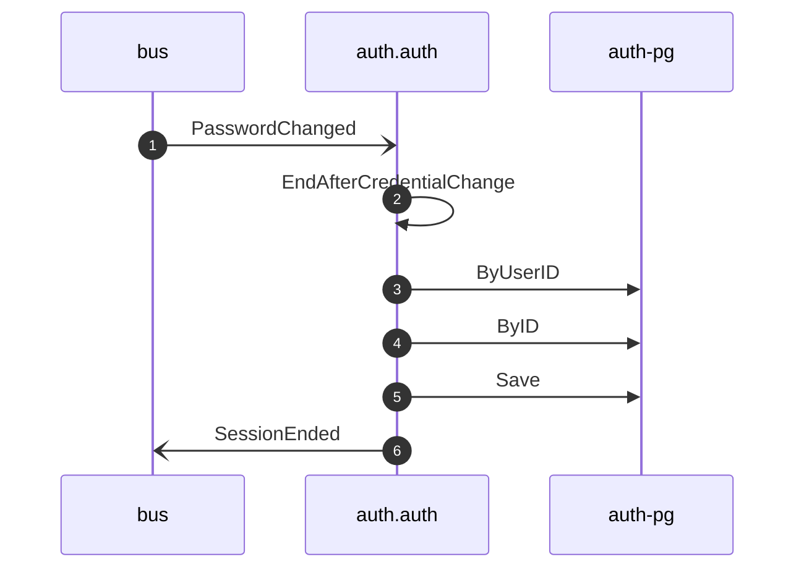

# Revoke sessions on password change

*Generated from the portolan catalog · commit `8 sources` · at 2026-09-05T03:14:52+07:00. Do not edit by hand.*

- **Id:** `flow.auth-revoke-sessions-on-password-change`
- **Owner:** [auth](../auth/README.md)
- **Source:** `examples/auth/internal/application/policy/revoke_sessions_on_password_change.go`

Ends the sessions issued against a password that has just been replaced.

## Participants

| Participant | Kind | Context |
| --- | --- | --- |
| `bus` | broker | — |
| `auth.auth` | service | [auth](../auth/README.md) |
| `auth-pg` | store | [auth](../auth/README.md) |

## Sequence

## Steps

1. **bus** → **auth.auth** — PasswordChanged
   [auth.auth.user.PasswordChanged](../auth/auth/aggregates/user.md) · `examples/auth/internal/application/policy/revoke_sessions_on_password_change.go:41` · Seen running in telemetry/traces.jsonl (1 trace).
2. **auth.auth** ↺ **auth.auth** — EndAfterCredentialChange
   status: declared · `examples/auth/internal/application/policy/revoke_sessions_on_password_change.go:47`
3. **auth.auth** → **auth-pg** — ByUserID
   status: declared · `examples/auth/internal/application/session/usecases/end_after_credential_change/usecase.go:40`
4. **auth.auth** → **auth-pg** — ByID
   status: declared · `examples/auth/internal/application/session/usecases/end_after_credential_change/usecase.go:62` · inside a loop over `change.Ends(sessions, uc.now())`, inside a loop over `retries`.
5. **auth.auth** → **auth-pg** — Save
   status: declared · `examples/auth/internal/application/session/usecases/end_after_credential_change/usecase.go:77` · inside a loop over `change.Ends(sessions, uc.now())`, inside a loop over `retries`.
6. **auth.auth** → **bus** — SessionEnded
   [auth.auth.session.SessionEnded](../auth/auth/aggregates/session.md) · `examples/auth/internal/application/session/usecases/end_after_credential_change/usecase.go:77` · inside a loop over `change.Ends(sessions, uc.now())`, inside a loop over `retries`.
