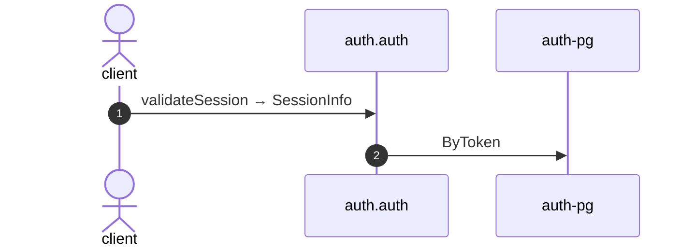

# Validate session

*Generated from the portolan catalog · commit `8 sources` · at 2026-08-29T09:14:22Z. Do not edit by hand.*

- **Id:** `flow.auth-validate-session`
- **Owner:** [auth](../auth/README.md)
- **Source:** `examples/auth/internal/infrastructure/transport/http/session/validate.go`

Resolves a token to a live session: who is calling, and how long the answer stays good.

## Participants

| Participant | Kind | Context |
| --- | --- | --- |
| `client` | actor | — |
| `auth.auth` | service | [auth](../auth/README.md) |
| `auth-pg` | store | [auth](../auth/README.md) |

## Sequence

## Steps

1. **client** → **auth.auth** — validateSession → SessionInfo
   `examples/auth/internal/infrastructure/transport/http/session/validate.go:12` · Seen running in telemetry/traces.jsonl (2 traces).
2. **auth.auth** → **auth-pg** — ByToken
   status: declared · `examples/auth/internal/application/session/usecases/validate/usecase.go:34`
