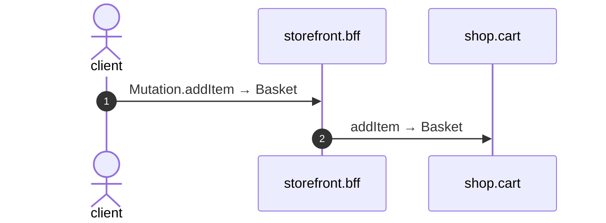

# Mutation add item

*Generated from the portolan catalog · commit `6 sources` · at 2026-09-05T03:58:04Z. Do not edit by hand.*

- **Id:** `flow.bff-mutation-add-item`
- **Owner:** [storefront](../storefront/README.md)
- **Source:** `examples/bff/src/schema/basket/resolvers/Mutation/addItem.ts`

Add a line. The price travels as the customer was shown it; the cart captures it and never recomputes it, and nothing here checks it - a storefront that priced things would be a second place prices live.

## Participants

| Participant | Kind | Context |
| --- | --- | --- |
| `client` | actor | — |
| `storefront.bff` | service | [storefront](../storefront/README.md) |
| `shop.cart` | service | [shop](../shop/README.md) |

## Sequence

## Steps

1. **client** → **storefront.bff** — Mutation.addItem → Basket
   status: declared · `examples/bff/src/schema/basket/resolvers/Mutation/addItem.ts:8`
2. **storefront.bff** → **shop.cart** — addItem → Basket
   `cart.v1.Baskets/addItem` · status: declared · `examples/bff/src/schema/basket/resolvers/Mutation/addItem.ts:9`
