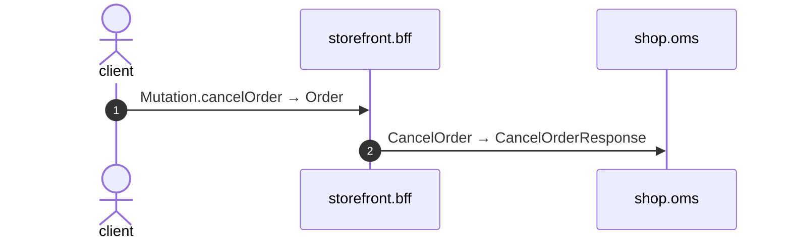

# Mutation cancel order

*Generated from the portolan catalog · commit `6 sources` · at 2026-09-05T03:58:04Z. Do not edit by hand.*

- **Id:** `flow.bff-mutation-cancel-order`
- **Owner:** [storefront](../storefront/README.md)
- **Source:** `examples/bff/src/schema/order/resolvers/Mutation/cancelOrder.ts`

Cancel an order. Whether it is too late to is the order service's judgement and its refusal travels back unchanged; this service does not know what dispatch means.

## Participants

| Participant | Kind | Context |
| --- | --- | --- |
| `client` | actor | — |
| `storefront.bff` | service | [storefront](../storefront/README.md) |
| `shop.oms` | service | [shop](../shop/README.md) |

## Sequence

## Steps

1. **client** → **storefront.bff** — Mutation.cancelOrder → Order
   status: declared · `examples/bff/src/schema/order/resolvers/Mutation/cancelOrder.ts:8`
2. **storefront.bff** → **shop.oms** — CancelOrder → CancelOrderResponse
   `shop.v1.OrderService/CancelOrder` · status: declared · `examples/bff/src/schema/order/resolvers/Mutation/cancelOrder.ts:9`
