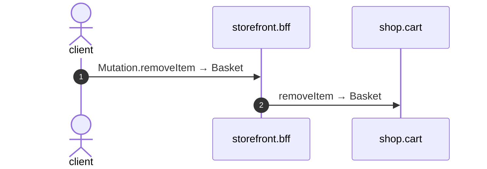

# Mutation remove item

*Generated from the portolan catalog · commit `7 sources` · at 2026-09-05T03:58:04Z. Do not edit by hand.*

- **Id:** `flow.bff-mutation-remove-item`
- **Owner:** [storefront](../storefront/README.md)
- **Source:** `examples/bff/src/schema/basket/resolvers/Mutation/removeItem.ts`

## Participants

| Participant | Kind | Context |
| --- | --- | --- |
| `client` | actor | — |
| `storefront.bff` | service | [storefront](../storefront/README.md) |
| `shop.cart` | service | [shop](../shop/README.md) |

## Sequence

## Steps

1. **client** → **storefront.bff** — Mutation.removeItem → Basket
   status: declared · `examples/bff/src/schema/basket/resolvers/Mutation/removeItem.ts:3`
2. **storefront.bff** → **shop.cart** — removeItem → Basket
   `cart.v1.Baskets/removeItem` · status: declared · `examples/bff/src/schema/basket/resolvers/Mutation/removeItem.ts:4`
