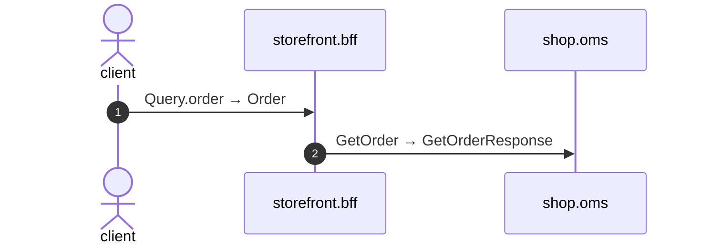

# Query order

*Generated from the portolan catalog · commit `8 sources` · at 2026-09-05T03:14:52+07:00. Do not edit by hand.*

- **Id:** `flow.bff-query-order`
- **Owner:** [storefront](../storefront/README.md)
- **Source:** `examples/bff/src/schema/order/resolvers/Query/order.ts`

## Participants

| Participant | Kind | Context |
| --- | --- | --- |
| `client` | actor | — |
| `storefront.bff` | service | [storefront](../storefront/README.md) |
| `shop.oms` | service | [shop](../shop/README.md) |

## Sequence

## Steps

1. **client** → **storefront.bff** — Query.order → Order
   status: declared · `examples/bff/src/schema/order/resolvers/Query/order.ts:3`
2. **storefront.bff** → **shop.oms** — GetOrder → GetOrderResponse
   `shop.v1.OrderService/GetOrder` · status: declared · `examples/bff/src/schema/order/resolvers/Query/order.ts:4`
