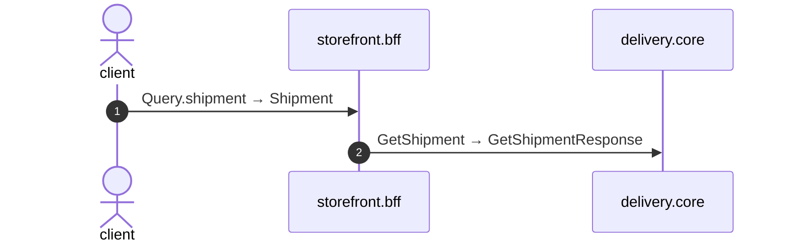

# Query shipment

*Generated from the portolan catalog · commit `8 sources` · at 2026-09-05T03:14:52+07:00. Do not edit by hand.*

- **Id:** `flow.bff-query-shipment`
- **Owner:** [storefront](../storefront/README.md)
- **Source:** `examples/bff/src/schema/delivery/resolvers/Query/shipment.ts`

## Participants

| Participant | Kind | Context |
| --- | --- | --- |
| `client` | actor | — |
| `storefront.bff` | service | [storefront](../storefront/README.md) |
| `delivery.core` | service | [delivery](../delivery/README.md) |

## Sequence

## Steps

1. **client** → **storefront.bff** — Query.shipment → Shipment
   status: declared · `examples/bff/src/schema/delivery/resolvers/Query/shipment.ts:3`
2. **storefront.bff** → **delivery.core** — GetShipment → GetShipmentResponse
   `delivery.v1.Delivery/GetShipment` · status: declared · `examples/bff/src/schema/delivery/resolvers/Query/shipment.ts:4`
