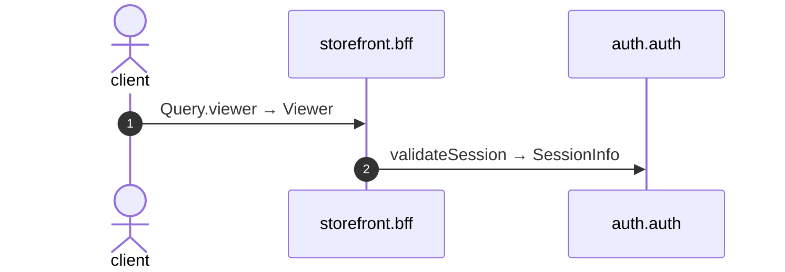

# Query viewer

*Generated from the portolan catalog · commit `7 sources` · at 2026-09-05T03:14:52+07:00. Do not edit by hand.*

- **Id:** `flow.bff-query-viewer`
- **Owner:** [storefront](../storefront/README.md)
- **Source:** `examples/bff/src/schema/viewer/resolvers/Query/viewer.ts`

Who the request belongs to. Auth is asked on every call rather than a token being read here: this service holds no key and could not tell a forged one from a live one.

## Participants

| Participant | Kind | Context |
| --- | --- | --- |
| `client` | actor | — |
| `storefront.bff` | service | [storefront](../storefront/README.md) |
| `auth.auth` | service | [auth](../auth/README.md) |

## Sequence

## Steps

1. **client** → **storefront.bff** — Query.viewer → Viewer
   status: declared · `examples/bff/src/schema/viewer/resolvers/Query/viewer.ts:8`
2. **storefront.bff** → **auth.auth** — validateSession → SessionInfo
   `auth.v1.Sessions/validateSession` · status: declared · `examples/bff/src/schema/viewer/resolvers/Query/viewer.ts:9`
