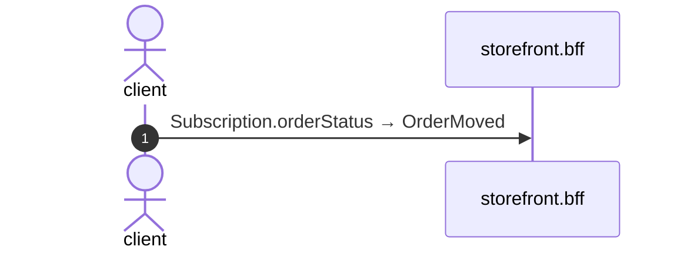

# Subscription order status

*Generated from the portolan catalog · commit `12 sources` · at 2026-09-05T13:47:23+07:00. Do not edit by hand.*

- **Id:** `flow.bff-subscription-order-status`
- **Owner:** [storefront](../storefront/README.md)
- **Source:** [`examples/bff/src/schema/order/resolvers/Subscription/orderStatus.ts`](https://github.com/shortlink-org/portolan/blob/main/examples/bff/src/schema/order/resolvers/Subscription/orderStatus.ts)

Every move of one order, for as long as somebody is watching it.

## Participants

| Participant | Kind | Context |
| --- | --- | --- |
| `client` | actor | — |
| `storefront.bff` | service | [storefront](../storefront/README.md) |

## Sequence

## Steps

1. **client** → **storefront.bff** — Subscription.orderStatus → OrderMoved
   status: declared · [`examples/bff/src/schema/order/resolvers/Subscription/orderStatus.ts:11`](https://github.com/shortlink-org/portolan/blob/main/examples/bff/src/schema/order/resolvers/Subscription/orderStatus.ts#L11)
