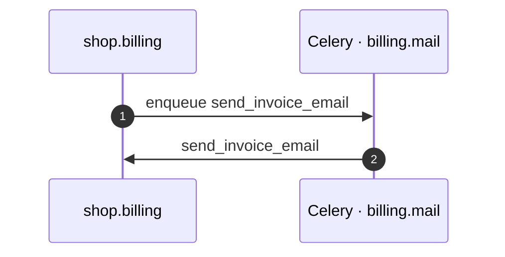

# Send Invoice Email task

*Generated from the portolan catalog · commit `10 sources` · at 2026-09-05T13:47:23+07:00. Do not edit by hand.*

- **Id:** `flow.billing-celery-send-invoice-email`
- **Owner:** [shop](../shop/README.md)
- **Source:** [`examples/shop/billing/invoices/services.py`](https://github.com/shortlink-org/portolan/blob/main/examples/shop/billing/invoices/services.py)

Celery task `invoices.tasks.send_invoice_email` is enqueued on `billing.mail` and worked by `send_invoice_email`.

## Participants

| Participant | Kind | Context | Label |
| --- | --- | --- | --- |
| `shop.billing` | service | [shop](../shop/README.md) | — |
| `celery-billing-mail` | broker | — | Celery · billing.mail |

## Sequence

## Steps

1. **shop.billing** → **celery-billing-mail** — enqueue send_invoice_email
   status: declared · [`examples/shop/billing/invoices/services.py:49`](https://github.com/shortlink-org/portolan/blob/main/examples/shop/billing/invoices/services.py#L49) · Enqueued after the transaction commits. Emails the customer the invoice they were asked to pay.

2. **celery-billing-mail** → **shop.billing** — send_invoice_email
   status: declared · [`examples/shop/billing/invoices/tasks.py:18`](https://github.com/shortlink-org/portolan/blob/main/examples/shop/billing/invoices/tasks.py#L18) · Celery hands `invoices.tasks.send_invoice_email` to the worker consuming `billing.mail`, routed by task_routes.
