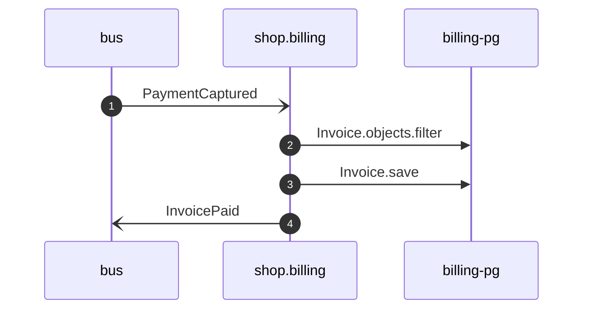

# Close invoice on payment

*Generated from the portolan catalog · commit `7 sources` · at 2026-08-29T09:14:22Z. Do not edit by hand.*

- **Id:** `flow.billing-close-invoice-on-payment`
- **Owner:** [shop](../shop/README.md)
- **Source:** `examples/shop/billing/invoices/handlers.py`

Closes the invoice for an order once the ledger says the money arrived.

## Participants

| Participant | Kind | Context |
| --- | --- | --- |
| `bus` | broker | — |
| `shop.billing` | service | [shop](../shop/README.md) |
| `billing-pg` | store | [shop](../shop/README.md) |

## Sequence

## Steps

1. **bus** → **shop.billing** — PaymentCaptured
   [payments.ledger.payment.PaymentCaptured](../payments/ledger/aggregates/payment.md) · status: declared · `examples/shop/billing/invoices/handlers.py:10`
2. **shop.billing** → **billing-pg** — Invoice.objects.filter
   status: declared · `examples/shop/billing/invoices/services.py:48`
3. **shop.billing** → **billing-pg** — Invoice.save
   status: declared · `examples/shop/billing/invoices/services.py:52`
4. **shop.billing** → **bus** — InvoicePaid
   [shop.billing.invoice.InvoicePaid](../shop/billing/aggregates/invoice.md) · status: declared · `examples/shop/billing/invoices/services.py:53`
