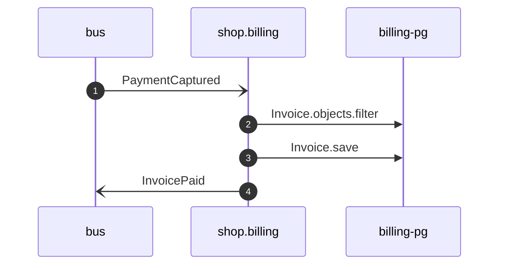

# Close invoice on payment

*Generated from the portolan catalog · commit `12 sources` · at 2026-09-05T13:47:23+07:00. Do not edit by hand.*

- **Id:** `flow.billing-close-invoice-on-payment`
- **Owner:** [shop](../shop/README.md)
- **Source:** [`examples/shop/billing/invoices/handlers.py`](https://github.com/shortlink-org/portolan/blob/main/examples/shop/billing/invoices/handlers.py)

Closes the invoice for an order once the ledger says the money arrived.

## Participants

| Participant | Kind | Context |
| --- | --- | --- |
| `bus` | broker | — |
| `shop.billing` | service | [shop](../shop/README.md) |
| `billing-pg` | store | [shop](../shop/README.md) |

## Sequence

## Steps

1. **bus** → **shop.billing** — PaymentCaptured
   [`payments.ledger.payment.PaymentCaptured`](../payments/ledger/aggregates/payment.md#event-payments-ledger-payment-paymentcaptured) · status: declared · [`examples/shop/billing/invoices/handlers.py:10`](https://github.com/shortlink-org/portolan/blob/main/examples/shop/billing/invoices/handlers.py#L10)

2. **shop.billing** → **billing-pg** — Invoice.objects.filter
   status: declared · [`examples/shop/billing/invoices/services.py:57`](https://github.com/shortlink-org/portolan/blob/main/examples/shop/billing/invoices/services.py#L57)

3. **shop.billing** → **billing-pg** — Invoice.save
   status: declared · [`examples/shop/billing/invoices/services.py:61`](https://github.com/shortlink-org/portolan/blob/main/examples/shop/billing/invoices/services.py#L61)

4. **shop.billing** → **bus** — InvoicePaid
   [`shop.billing.invoice.InvoicePaid`](../shop/billing/aggregates/invoice.md#event-shop-billing-invoice-invoicepaid) · status: declared · [`examples/shop/billing/invoices/services.py:62`](https://github.com/shortlink-org/portolan/blob/main/examples/shop/billing/invoices/services.py#L62) · on shop.billing.invoice
