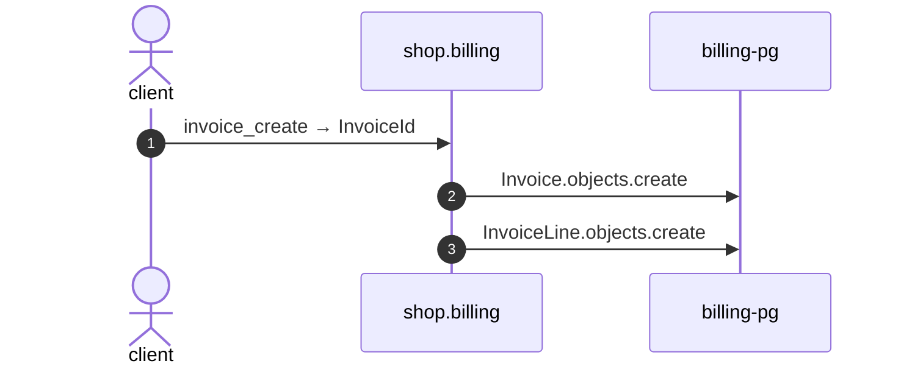

# Invoice create

*Generated from the portolan catalog · commit `11 sources` · at 2026-09-05T13:47:23+07:00. Do not edit by hand.*

- **Id:** `flow.billing-invoice-create`
- **Owner:** [shop](../shop/README.md)
- **Source:** [`examples/shop/billing/invoices/views.py`](https://github.com/shortlink-org/portolan/blob/main/examples/shop/billing/invoices/views.py)

Draws up a draft invoice for an order, with a line for each thing sold.

## Participants

| Participant | Kind | Context |
| --- | --- | --- |
| `client` | actor | — |
| `shop.billing` | service | [shop](../shop/README.md) |
| `billing-pg` | store | [shop](../shop/README.md) |

## Sequence

## Steps

1. **client** → **shop.billing** — invoice_create → InvoiceId
   status: declared · [`examples/shop/billing/invoices/views.py:13`](https://github.com/shortlink-org/portolan/blob/main/examples/shop/billing/invoices/views.py#L13)

2. **shop.billing** → **billing-pg** — Invoice.objects.create
   status: declared · [`examples/shop/billing/invoices/services.py:20`](https://github.com/shortlink-org/portolan/blob/main/examples/shop/billing/invoices/services.py#L20) · in one transaction.

3. **shop.billing** → **billing-pg** — InvoiceLine.objects.create
   status: declared · [`examples/shop/billing/invoices/services.py:29`](https://github.com/shortlink-org/portolan/blob/main/examples/shop/billing/invoices/services.py#L29) · in one transaction, for each line.
