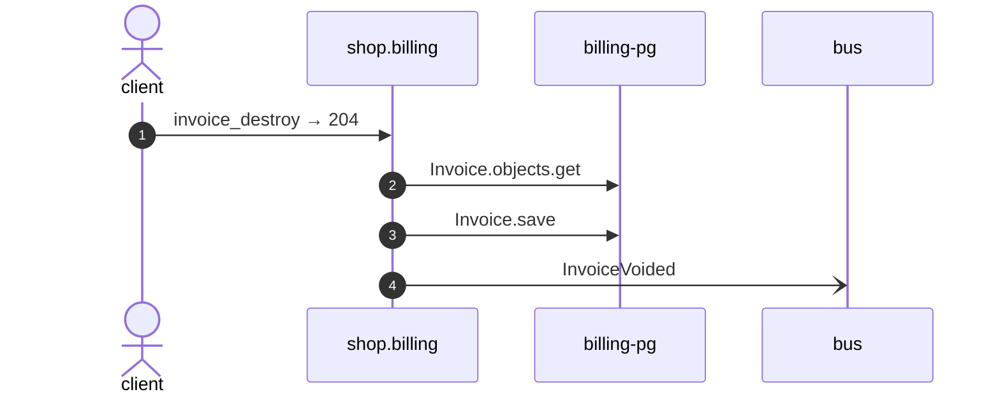

# Invoice destroy

*Generated from the portolan catalog · commit `4 sources` · at 2026-09-05T03:58:04Z. Do not edit by hand.*

- **Id:** `flow.billing-invoice-destroy`
- **Owner:** [shop](../shop/README.md)
- **Source:** `examples/shop/billing/invoices/views.py`

Ends an invoice nobody is going to pay.

## Participants

| Participant | Kind | Context |
| --- | --- | --- |
| `client` | actor | — |
| `shop.billing` | service | [shop](../shop/README.md) |
| `billing-pg` | store | [shop](../shop/README.md) |
| `bus` | broker | — |

## Sequence

## Steps

1. **client** → **shop.billing** — invoice_destroy → 204
   status: declared · `examples/shop/billing/invoices/views.py:34`
2. **shop.billing** → **billing-pg** — Invoice.objects.get
   status: declared · `examples/shop/billing/invoices/services.py:59`
3. **shop.billing** → **billing-pg** — Invoice.save
   status: declared · `examples/shop/billing/invoices/services.py:61`
4. **shop.billing** → **bus** — InvoiceVoided
   [shop.billing.invoice.InvoiceVoided](../shop/billing/aggregates/invoice.md) · status: declared · `examples/shop/billing/invoices/services.py:62`
