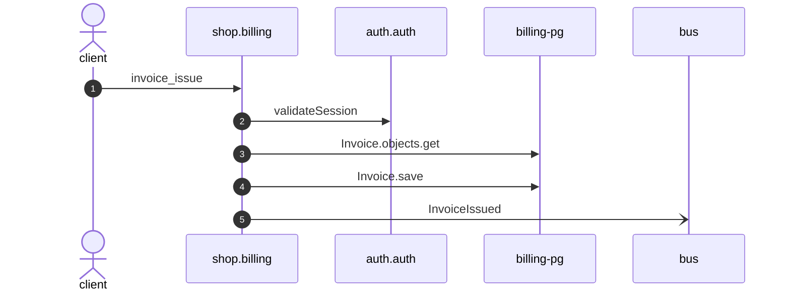

# Invoice issue

*Generated from the portolan catalog · commit `6 sources` · at 2026-08-29T09:14:22Z. Do not edit by hand.*

- **Id:** `flow.billing-invoice-issue`
- **Owner:** [shop](../shop/README.md)
- **Source:** `examples/shop/billing/invoices/views.py`

Confirms the session, freezes the invoice and asks the customer to pay.

## Participants

| Participant | Kind | Context |
| --- | --- | --- |
| `client` | actor | — |
| `shop.billing` | service | [shop](../shop/README.md) |
| `auth.auth` | service | [auth](../auth/README.md) |
| `billing-pg` | store | [shop](../shop/README.md) |
| `bus` | broker | — |

## Sequence

## Steps

1. **client** → **shop.billing** — invoice_issue
   status: declared · `examples/shop/billing/invoices/views.py:29`
2. **shop.billing** → **auth.auth** — validateSession
   `auth.v1.Sessions/validateSession` · status: declared · `examples/shop/billing/invoices/services.py:36`
3. **shop.billing** → **billing-pg** — Invoice.objects.get
   status: declared · `examples/shop/billing/invoices/services.py:37`
4. **shop.billing** → **billing-pg** — Invoice.save
   status: declared · `examples/shop/billing/invoices/services.py:41`
5. **shop.billing** → **bus** — InvoiceIssued
   [shop.billing.invoice.InvoiceIssued](../shop/billing/aggregates/invoice.md) · status: declared · `examples/shop/billing/invoices/services.py:42`
