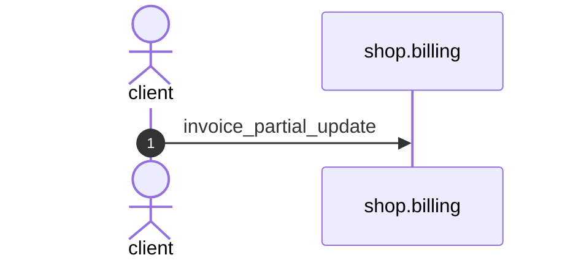

# Invoice partial update

*Generated from the portolan catalog · commit `13 sources` · at 2026-09-05T13:47:23+07:00. Do not edit by hand.*

- **Id:** `flow.billing-invoice-partial-update`
- **Owner:** [shop](../shop/README.md)
- **Source:** [`examples/shop/billing/invoices/views.py`](https://github.com/shortlink-org/portolan/blob/main/examples/shop/billing/invoices/views.py)

Invoices over HTTP. Every action here runs one function of services.py.

## Participants

| Participant | Kind | Context |
| --- | --- | --- |
| `client` | actor | — |
| `shop.billing` | service | [shop](../shop/README.md) |

## Sequence

## Steps

1. **client** → **shop.billing** — invoice_partial_update
   status: declared · [`examples/shop/billing/invoices/views.py:10`](https://github.com/shortlink-org/portolan/blob/main/examples/shop/billing/invoices/views.py#L10)
