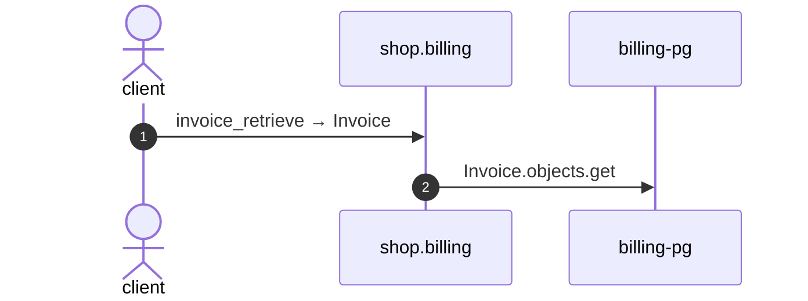

# Invoice retrieve

*Generated from the portolan catalog · commit `8 sources` · at 2026-09-05T03:14:52+07:00. Do not edit by hand.*

- **Id:** `flow.billing-invoice-retrieve`
- **Owner:** [shop](../shop/README.md)
- **Source:** `examples/shop/billing/invoices/views.py`

Reads one invoice and the lines it is made of.

## Participants

| Participant | Kind | Context |
| --- | --- | --- |
| `client` | actor | — |
| `shop.billing` | service | [shop](../shop/README.md) |
| `billing-pg` | store | [shop](../shop/README.md) |

## Sequence

## Steps

1. **client** → **shop.billing** — invoice_retrieve → Invoice
   status: declared · `examples/shop/billing/invoices/views.py:24`
2. **shop.billing** → **billing-pg** — Invoice.objects.get
   status: declared · `examples/shop/billing/invoices/services.py:68`
