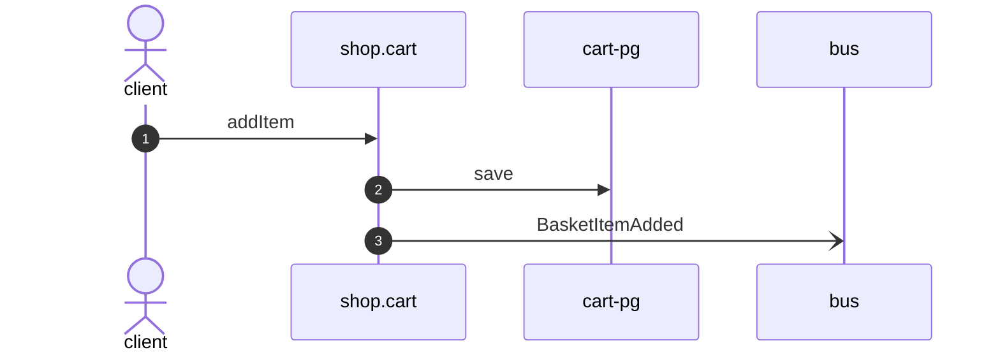

# Add item

*Generated from the portolan catalog · commit `5 sources` · at 2026-08-29T09:14:22Z. Do not edit by hand.*

- **Id:** `flow.cart-add-item`
- **Owner:** [shop](../shop/README.md)
- **Source:** `examples/shop/cart/src/infrastructure/transport/http/basket/handlers.ts`

## Participants

| Participant | Kind | Context |
| --- | --- | --- |
| `client` | actor | — |
| `shop.cart` | service | [shop](../shop/README.md) |
| `cart-pg` | store | [shop](../shop/README.md) |
| `bus` | broker | — |

## Sequence

## Steps

1. **client** → **shop.cart** — addItem
   `examples/shop/cart/src/infrastructure/transport/http/basket/handlers.ts:43` · Seen running in telemetry/traces.jsonl (3 traces).
2. **shop.cart** → **cart-pg** — save
   status: declared · `examples/shop/cart/src/application/basket/usecases/add_item/usecase.ts:27`
3. **shop.cart** → **bus** — BasketItemAdded
   [shop.cart.basket.BasketItemAdded](../shop/cart/aggregates/basket.md) · `examples/shop/cart/src/application/basket/usecases/add_item/usecase.ts:27` · Seen running in telemetry/traces.jsonl (3 traces).
