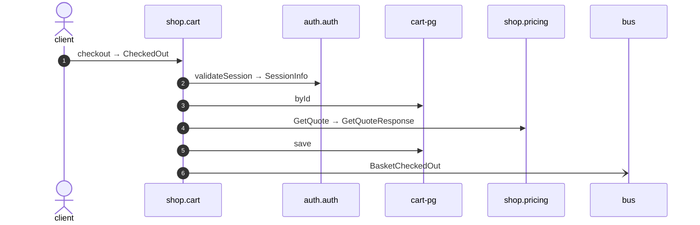

# Checkout

*Generated from the portolan catalog · commit `10 sources` · at 2026-09-05T03:58:04Z. Do not edit by hand.*

- **Id:** `flow.cart-checkout`
- **Owner:** [shop](../shop/README.md)
- **Source:** [`examples/shop/cart/src/infrastructure/transport/http/basket/handlers.ts`](https://github.com/shortlink-org/portolan/blob/main/examples/shop/cart/src/infrastructure/transport/http/basket/handlers.ts)

## Participants

| Participant | Kind | Context |
| --- | --- | --- |
| `client` | actor | — |
| `shop.cart` | service | [shop](../shop/README.md) |
| `auth.auth` | service | [auth](../auth/README.md) |
| `cart-pg` | store | [shop](../shop/README.md) |
| `shop.pricing` | service | [shop](../shop/README.md) |
| `bus` | broker | — |

## Sequence

## Steps

1. **client** → **shop.cart** — checkout → CheckedOut
   [`examples/shop/cart/src/infrastructure/transport/http/basket/handlers.ts:60`](https://github.com/shortlink-org/portolan/blob/main/examples/shop/cart/src/infrastructure/transport/http/basket/handlers.ts#L60) · Seen running in telemetry/traces.jsonl (1 trace).

2. **shop.cart** → **auth.auth** — validateSession → SessionInfo
   `auth.v1.Sessions/validateSession` · [`examples/shop/cart/src/application/basket/usecases/checkout/usecase.ts:44`](https://github.com/shortlink-org/portolan/blob/main/examples/shop/cart/src/application/basket/usecases/checkout/usecase.ts#L44) · Seen running in telemetry/traces.jsonl (1 trace).

3. **shop.cart** → **cart-pg** — byId
   status: declared · [`examples/shop/cart/src/application/basket/usecases/checkout/usecase.ts:48`](https://github.com/shortlink-org/portolan/blob/main/examples/shop/cart/src/application/basket/usecases/checkout/usecase.ts#L48)

4. **shop.cart** → **shop.pricing** — GetQuote → GetQuoteResponse
   `shop.v1.Pricing/GetQuote` · status: declared · [`examples/shop/cart/src/application/basket/usecases/checkout/usecase.ts:55`](https://github.com/shortlink-org/portolan/blob/main/examples/shop/cart/src/application/basket/usecases/checkout/usecase.ts#L55)

5. **shop.cart** → **cart-pg** — save
   status: declared · [`examples/shop/cart/src/application/basket/usecases/checkout/usecase.ts:57`](https://github.com/shortlink-org/portolan/blob/main/examples/shop/cart/src/application/basket/usecases/checkout/usecase.ts#L57)

6. **shop.cart** → **bus** — BasketCheckedOut
   [`shop.cart.basket.BasketCheckedOut`](../shop/cart/aggregates/basket.md#event-shop-cart-basket-basketcheckedout) · [`examples/shop/cart/src/application/basket/usecases/checkout/usecase.ts:57`](https://github.com/shortlink-org/portolan/blob/main/examples/shop/cart/src/application/basket/usecases/checkout/usecase.ts#L57) · Seen running in telemetry/traces.jsonl (1 trace).
