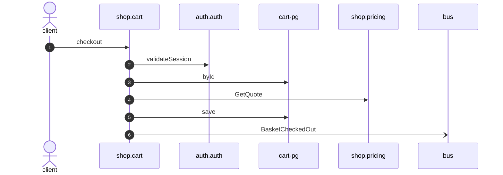

# Checkout

*Generated from the portolan catalog · commit `5 sources` · at 2026-08-29T09:14:22Z. Do not edit by hand.*

- **Id:** `flow.cart-checkout`
- **Owner:** [shop](../shop/README.md)
- **Source:** `examples/shop/cart/src/infrastructure/transport/http/basket/handlers.ts`

## Participants

| Participant | Kind | Context |
| --- | --- | --- |
| `client` | actor | — |
| `shop.cart` | service | [shop](../shop/README.md) |
| `auth.auth` | service | [auth](../auth/README.md) |
| `cart-pg` | store | [shop](../shop/README.md) |
| `shop.pricing` | service | [shop](../shop/README.md) |
| `bus` | broker | — |

## Sequence

## Steps

1. **client** → **shop.cart** — checkout
   `examples/shop/cart/src/infrastructure/transport/http/basket/handlers.ts:60` · Seen running in telemetry/traces.jsonl (1 trace).
2. **shop.cart** → **auth.auth** — validateSession
   `auth.v1.Sessions/validateSession` · `examples/shop/cart/src/application/basket/usecases/checkout/usecase.ts:44` · Seen running in telemetry/traces.jsonl (1 trace).
3. **shop.cart** → **cart-pg** — byId
   status: declared · `examples/shop/cart/src/application/basket/usecases/checkout/usecase.ts:48`
4. **shop.cart** → **shop.pricing** — GetQuote
   `shop.v1.Pricing/GetQuote` · status: declared · `examples/shop/cart/src/application/basket/usecases/checkout/usecase.ts:55`
5. **shop.cart** → **cart-pg** — save
   status: declared · `examples/shop/cart/src/application/basket/usecases/checkout/usecase.ts:57`
6. **shop.cart** → **bus** — BasketCheckedOut
   [shop.cart.basket.BasketCheckedOut](../shop/cart/aggregates/basket.md) · `examples/shop/cart/src/application/basket/usecases/checkout/usecase.ts:57` · Seen running in telemetry/traces.jsonl (1 trace).
