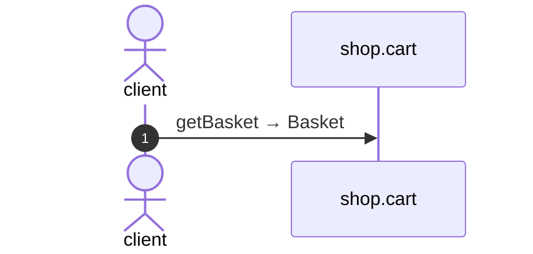

# Get basket

*Generated from the portolan catalog · commit `5 sources` · at 2026-08-29T09:14:22Z. Do not edit by hand.*

- **Id:** `flow.cart-get-basket`
- **Owner:** [shop](../shop/README.md)
- **Source:** `examples/shop/cart/src/infrastructure/transport/http/basket/handlers.ts`

## Participants

| Participant | Kind | Context |
| --- | --- | --- |
| `client` | actor | — |
| `shop.cart` | service | [shop](../shop/README.md) |

## Sequence

## Steps

1. **client** → **shop.cart** — getBasket → Basket
   `examples/shop/cart/src/infrastructure/transport/http/basket/handlers.ts:38` · Seen running in telemetry/traces.jsonl (2 traces).
