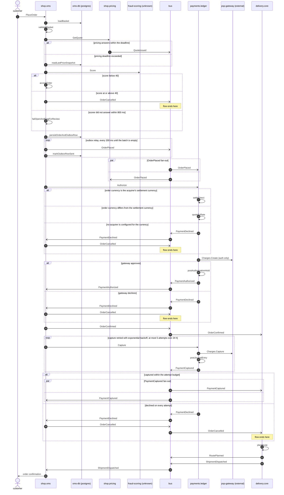

# Checkout

*Generated from the portolan catalog · commit `4 sources` · at 2026-08-29T09:14:22Z. Do not edit by hand.*

- **Id:** `flow.checkout`
- **Owner:** [shop](../shop/README.md)
- **Source:** `services/oms/test/e2e/checkout_test.go`

Basket to dispatch, as the e2e suite drives it: a priced basket, a risk call whose peer is not in the catalog, an outbox publish, an authorization at the gateway, a capture retried with backoff, and a shipment held until the money lands. Three branches and two hops are read from the code rather than observed.

## Participants

| Participant | Kind | Context | Label |
| --- | --- | --- | --- |
| `customer` | actor | — | — |
| `shop.oms` | service | [shop](../shop/README.md) | — |
| `oms-db` | store | [shop](../shop/README.md) | oms-db (postgres) |
| `shop.pricing` | service | [shop](../shop/README.md) | — |
| `fraud-scoring` | unknown | — | fraud-scoring (unknown) |
| `bus` | broker | — | — |
| `payments.ledger` | service | [payments](../payments/README.md) | — |
| `psp-gateway` | external | — | psp-gateway (external) |
| `delivery.core` | service | [delivery](../delivery/README.md) | — |

## Sequence

## Steps

1. **customer** → **shop.oms** — PlaceOrder
   `checkout_test.go:62` · HTTP edge. The handler requires an Idempotency-Key header and replays the stored response for a key it has already answered, so a double-tapped checkout cannot open two orders.
2. **shop.oms** → **oms-db** — loadBasket
   `internal/oms/adapter/postgres/basket_repo.go:58`
3. **shop.oms** ↺ **shop.oms** — validateBasket
   `internal/oms/app/checkout.go:88` · Rejects empty baskets and lines whose stock reservation has expired. Runs before anything leaves the process.
4. **shop.oms** → **shop.pricing** — GetQuote
   `shop.v1.Pricing/GetQuote` · `internal/oms/app/checkout.go:104` · 250 ms deadline, one retry on UNAVAILABLE.

> **One of**
>
> *pricing answers within the deadline*
>
> 5. **shop.pricing** → **bus** — QuoteIssued
>    [shop.pricing.quote.QuoteIssued](../shop/pricing/aggregates/quote.md) · `checkout_test.go:96` · Published for the audit trail. The price checkout actually uses is the synchronous response above, not this event.
>
> *pricing deadline exceeded*
>
> 6. **shop.oms** → **oms-db** — readLastPriceSnapshot
>    status: declared · `internal/oms/app/checkout.go:118` · Falls back to the snapshot written by the last price-list import and marks the order repriceable. The e2e suite has no case for this branch; it is read from the code.

7. **shop.oms** → **fraud-scoring** — Score
   `fraud.v2.Scoring/Score` · status: unresolved · `internal/oms/client/fraud.go:22` · No service in the catalog provides fraud.v2.Scoring. The address comes from FRAUD_ADDR at runtime, so the peer cannot be resolved statically.

> **One of**
>
> *score below 40*
>
> 8. **shop.oms** ↺ **shop.oms** — acceptOrder
>    `checkout_test.go:131`
>
> *score at or above 40 — *ends the flow**
>
> 9. **shop.oms** → **bus** — OrderCancelled
>    [shop.oms.order.OrderCancelled](../shop/oms/aggregates/order.md) · status: declared · `internal/oms/app/checkout.go:176` · The customer is shown a generic decline and the score never reaches the edge. Declared: the suite has no high-score fixture.
>
> *scorer did not answer within 800 ms*
>
> 10. **shop.oms** ↺ **shop.oms** — failOpenAndFlagForReview
>    status: declared · `internal/oms/app/checkout.go:161` · The order continues and is queued for manual review. Failing open is read from the code; nothing exercises the timeout.

11. **shop.oms** → **oms-db** — persistOrderAndOutboxRow
   `internal/oms/app/checkout.go:191` · One transaction for the order and the OrderPlaced outbox row. The order-accepted flow pins this hop on its own.

> **Repeats** — outbox relay, every 200 ms until the batch is empty
>
> 12. **shop.oms** → **bus** — OrderPlaced
>    [shop.oms.order.OrderPlaced](../shop/oms/aggregates/order.md) · `checkout_test.go:118`
> 13. **shop.oms** → **oms-db** — markOutboxRowSent
>    `internal/oms/adapter/postgres/outbox.go:73` · Marking happens after the broker acks, so a crash in between republishes rather than drops. Consumers are expected to tolerate the repeat.

> **In parallel** — OrderPlaced fan-out
>
> *Branch 1*
>
> 14. **bus** → **payments.ledger** — OrderPlaced
>    [shop.oms.order.OrderPlaced](../shop/oms/aggregates/order.md) · `checkout_test.go:126` · Consumer group `ledger-orders`. Opens the reconciliation record the gateway webhook later matches against.
>
> *Branch 2*
>
> 15. **bus** → **shop.pricing** — OrderPlaced
>    [shop.oms.order.OrderPlaced](../shop/oms/aggregates/order.md) · status: declared · `internal/pricing/app/subscribe.go:38` · Pricing marks the quote consumed. The subscription is registered in code but no test drives it.

16. **shop.oms** → **payments.ledger** — Authorize
   `payments.v1.Payments/Authorize` · `checkout_test.go:141` · Carries the same idempotency key as the edge request, so a retried checkout cannot authorize twice.

> **One of**
>
> *order currency is the acquirer's settlement currency*
>
> 17. **payments.ledger** ↺ **payments.ledger** — settleDirect
>    `checkout_test.go:144` · No conversion and no FX row: `settlement` is the order amount. This is every EUR order, which is most of them.
>
> *order currency differs from the settlement currency*
>
> 18. **payments.ledger** ↺ **payments.ledger** — quoteFxRate
>    status: declared · `internal/ledger/app/fx.go:38` · The rate comes from the acquirer, not from the daily reference feed, and is refused if it is more than 60 s old. It is stored on the payment so the posting can be reproduced later.
>
> *no acquirer is configured for the currency — *ends the flow**
>
> 19. **payments.ledger** → **bus** — PaymentDeclined
>    [payments.ledger.payment.PaymentDeclined](../payments/ledger/aggregates/payment.md) · status: declared · `internal/ledger/app/authorize.go:61` · Code `currency_unsupported`, category `hard`. Nothing retries it and no other acquirer is tried, because there is only one.
> 20. **bus** → **shop.oms** — PaymentDeclined
>    [payments.ledger.payment.PaymentDeclined](../payments/ledger/aggregates/payment.md) · status: declared · `internal/oms/app/decline.go:18`
> 21. **shop.oms** → **bus** — OrderCancelled
>    [shop.oms.order.OrderCancelled](../shop/oms/aggregates/order.md) · status: declared · `internal/oms/app/decline.go:29` · The customer is told the currency is not accepted. This is the one decline that is worth saying out loud, and the edge says it.

22. **payments.ledger** → **psp-gateway** — Charges.Create (auth only)
   `psp.v2.Charges/Create` · status: unresolved · `internal/ledger/adapter/psp/client.go:64` · Third-party gateway; no service in the estate provides psp.v2.Charges. A timeout here leaves the charge in a state only the gateway knows — the gateway-webhook flow is what resolves it.

> **One of**
>
> *gateway approves*
>
> 23. **payments.ledger** ↺ **payments.ledger** — postAuthorizationHold
>    `internal/ledger/app/authorize.go:88`
> 24. **payments.ledger** → **bus** — PaymentAuthorized
>    [payments.ledger.payment.PaymentAuthorized](../payments/ledger/aggregates/payment.md) · `checkout_test.go:151`
> 25. **bus** → **shop.oms** — PaymentAuthorized
>    [payments.ledger.payment.PaymentAuthorized](../payments/ledger/aggregates/payment.md) · `checkout_test.go:154`
>
> *gateway declines — *ends the flow**
>
> 26. **payments.ledger** → **bus** — PaymentDeclined
>    [payments.ledger.payment.PaymentDeclined](../payments/ledger/aggregates/payment.md) · `checkout_test.go:167`
> 27. **bus** → **shop.oms** — PaymentDeclined
>    [payments.ledger.payment.PaymentDeclined](../payments/ledger/aggregates/payment.md) · `checkout_test.go:170`
> 28. **shop.oms** → **bus** — OrderCancelled
>    [shop.oms.order.OrderCancelled](../shop/oms/aggregates/order.md) · status: declared · `internal/oms/app/decline.go:29` · The order is cancelled and the basket released. The publish is in the decline handler; no assertion covers it.

29. **shop.oms** → **bus** — OrderConfirmed
   [shop.oms.order.OrderConfirmed](../shop/oms/aggregates/order.md) · `checkout_test.go:158`
30. **bus** → **delivery.core** — OrderConfirmed
   [shop.oms.order.OrderConfirmed](../shop/oms/aggregates/order.md) · `internal/delivery/app/subscribe.go:44` · Creates the shipment in `held`. Nothing is handed to a carrier until the capture lands.

> **Repeats** — capture retried with exponential backoff, at most 5 attempts over 24 h
>
> 31. **shop.oms** → **payments.ledger** — Capture
>    `payments.v1.Payments/Capture` · status: declared · `internal/oms/app/capture.go:33` · The e2e suite stubs the ledger from this point, so the capture leg is read from the client rather than observed.
> 32. **payments.ledger** → **psp-gateway** — Charges.Capture
>    `psp.v2.Charges/Capture` · status: unresolved · `internal/ledger/adapter/psp/client.go:102`
> 33. **payments.ledger** ↺ **payments.ledger** — postJournalEntry
>    `internal/ledger/app/capture.go:59` · Idempotent by (order_id, attempt), so a retry after a timeout cannot double-post. See ADR payments.0004.
> 34. **payments.ledger** → **bus** — PaymentCaptured
>    [payments.ledger.payment.PaymentCaptured](../payments/ledger/aggregates/payment.md) · status: declared · `internal/ledger/app/capture.go:91`

> **One of**
>
> *captured within the attempt budget*
>
>
> > **In parallel** — PaymentCaptured fan-out
> >
> > *Branch 1*
> >
> > 35. **bus** → **delivery.core** — PaymentCaptured
> >    [payments.ledger.payment.PaymentCaptured](../payments/ledger/aggregates/payment.md) · `checkout_test.go:188` · Releases the held shipment. This is the hop that turns money into a parcel.
> >
> > *Branch 2*
> >
> > 36. **bus** → **shop.oms** — PaymentCaptured
> >    [payments.ledger.payment.PaymentCaptured](../payments/ledger/aggregates/payment.md) · `checkout_test.go:190`
>
>
> *declined on every attempt — *ends the flow**
>
> 37. **payments.ledger** → **bus** — PaymentDeclined
>    [payments.ledger.payment.PaymentDeclined](../payments/ledger/aggregates/payment.md) · status: declared · `internal/ledger/app/capture.go:118` · After the fifth attempt the authorization has expired anyway. Category `soft`: the customer can pay again, but not on this order.
> 38. **bus** → **shop.oms** — PaymentDeclined
>    [payments.ledger.payment.PaymentDeclined](../payments/ledger/aggregates/payment.md) · status: declared · `internal/oms/app/decline.go:18`
> 39. **shop.oms** → **bus** — OrderCancelled
>    [shop.oms.order.OrderCancelled](../shop/oms/aggregates/order.md) · status: declared · `internal/oms/app/decline.go:29`
> 40. **bus** → **delivery.core** — OrderCancelled
>    [shop.oms.order.OrderCancelled](../shop/oms/aggregates/order.md) · status: declared · `internal/delivery/app/subscribe.go:62` · Drops the shipment that has been sitting in `held` since the order was confirmed. Nothing observed this hop — it is the failure path nobody has watched run.

41. **delivery.core** ↺ **delivery.core** — planRoute
   `internal/delivery/app/route.go:71`
42. **delivery.core** → **bus** — RoutePlanned
   [delivery.core.route.RoutePlanned](../delivery/core/aggregates/route.md) · status: declared · `internal/delivery/app/route.go:94` · OMS subscribes to this for the promised delivery date. The publish is in the planner; the suite asserts the shipment, not the route.
43. **delivery.core** → **bus** — ShipmentDispatched
   [delivery.core.shipment.ShipmentDispatched](../delivery/core/aggregates/shipment.md) · `checkout_test.go:203`
44. **bus** → **shop.oms** — ShipmentDispatched
   [delivery.core.shipment.ShipmentDispatched](../delivery/core/aggregates/shipment.md) · `checkout_test.go:206`
45. **shop.oms** → **customer** — order confirmation
   status: declared · `internal/oms/notify/confirmation.go:27` · Handed to the transactional mail provider. The hop leaves the estate and nothing in the catalog covers what happens to it.
