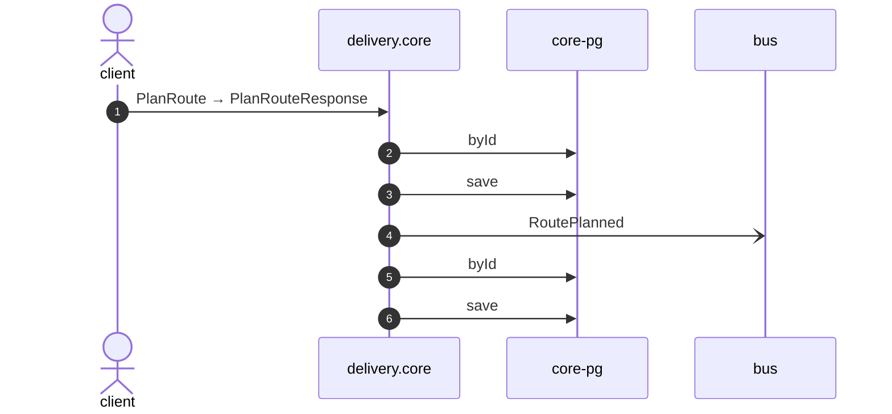

# Plan route

*Generated from the portolan catalog · commit `9 sources` · at 2026-09-05T13:47:23+07:00. Do not edit by hand.*

- **Id:** `flow.core-plan-route`
- **Owner:** [delivery](../delivery/README.md)
- **Source:** [`examples/shop/delivery/core/src/infrastructure/transport/grpc/route/handlers.ts`](https://github.com/shortlink-org/portolan/blob/main/examples/shop/delivery/core/src/infrastructure/transport/grpc/route/handlers.ts)

Builds a van's day out of the shipments waiting to go out.

## Participants

| Participant | Kind | Context |
| --- | --- | --- |
| `client` | actor | — |
| `delivery.core` | service | [delivery](../delivery/README.md) |
| `core-pg` | store | [delivery](../delivery/README.md) |
| `bus` | broker | — |

## Sequence

## Steps

1. **client** → **delivery.core** — PlanRoute → PlanRouteResponse
   status: declared · [`examples/shop/delivery/core/src/infrastructure/transport/grpc/route/handlers.ts:16`](https://github.com/shortlink-org/portolan/blob/main/examples/shop/delivery/core/src/infrastructure/transport/grpc/route/handlers.ts#L16)

2. **delivery.core** → **core-pg** — byId
   status: declared · [`examples/shop/delivery/core/src/application/route/usecases/plan_route/usecase.ts:27`](https://github.com/shortlink-org/portolan/blob/main/examples/shop/delivery/core/src/application/route/usecases/plan_route/usecase.ts#L27) · inside a loop over `shipmentIds`.

3. **delivery.core** → **core-pg** — save
   status: declared · [`examples/shop/delivery/core/src/application/route/usecases/plan_route/usecase.ts:34`](https://github.com/shortlink-org/portolan/blob/main/examples/shop/delivery/core/src/application/route/usecases/plan_route/usecase.ts#L34)

4. **delivery.core** → **bus** — RoutePlanned
   [`delivery.core.route.RoutePlanned`](../delivery/core/aggregates/route.md#event-delivery-core-route-routeplanned) · status: declared · [`examples/shop/delivery/core/src/application/route/usecases/plan_route/usecase.ts:34`](https://github.com/shortlink-org/portolan/blob/main/examples/shop/delivery/core/src/application/route/usecases/plan_route/usecase.ts#L34)

5. **delivery.core** → **core-pg** — byId
   status: declared · [`examples/shop/delivery/core/src/application/route/usecases/plan_route/usecase.ts:37`](https://github.com/shortlink-org/portolan/blob/main/examples/shop/delivery/core/src/application/route/usecases/plan_route/usecase.ts#L37) · inside a loop over `shipmentIds`.

6. **delivery.core** → **core-pg** — save
   status: declared · [`examples/shop/delivery/core/src/application/route/usecases/plan_route/usecase.ts:39`](https://github.com/shortlink-org/portolan/blob/main/examples/shop/delivery/core/src/application/route/usecases/plan_route/usecase.ts#L39) · inside a loop over `shipmentIds`.
