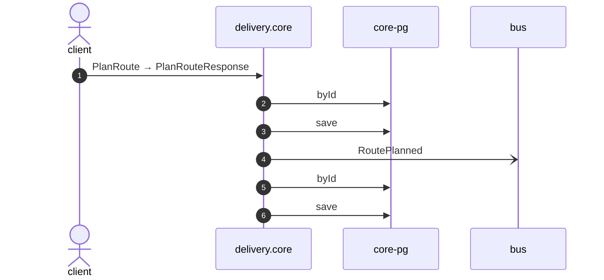

# Plan route

*Generated from the portolan catalog · commit `6 sources` · at 2026-09-05T03:58:04Z. Do not edit by hand.*

- **Id:** `flow.core-plan-route`
- **Owner:** [delivery](../delivery/README.md)
- **Source:** `examples/shop/delivery/core/src/infrastructure/transport/grpc/route/handlers.ts`

Builds a van's day out of the shipments waiting to go out.

## Participants

| Participant | Kind | Context |
| --- | --- | --- |
| `client` | actor | — |
| `delivery.core` | service | [delivery](../delivery/README.md) |
| `core-pg` | store | [delivery](../delivery/README.md) |
| `bus` | broker | — |

## Sequence

## Steps

1. **client** → **delivery.core** — PlanRoute → PlanRouteResponse
   status: declared · `examples/shop/delivery/core/src/infrastructure/transport/grpc/route/handlers.ts:14`
2. **delivery.core** → **core-pg** — byId
   status: declared · `examples/shop/delivery/core/src/application/route/usecases/plan_route/usecase.ts:27` · inside a loop over `shipmentIds`.
3. **delivery.core** → **core-pg** — save
   status: declared · `examples/shop/delivery/core/src/application/route/usecases/plan_route/usecase.ts:34`
4. **delivery.core** → **bus** — RoutePlanned
   [delivery.core.route.RoutePlanned](../delivery/core/aggregates/route.md) · status: declared · `examples/shop/delivery/core/src/application/route/usecases/plan_route/usecase.ts:34`
5. **delivery.core** → **core-pg** — byId
   status: declared · `examples/shop/delivery/core/src/application/route/usecases/plan_route/usecase.ts:37` · inside a loop over `shipmentIds`.
6. **delivery.core** → **core-pg** — save
   status: declared · `examples/shop/delivery/core/src/application/route/usecases/plan_route/usecase.ts:39` · inside a loop over `shipmentIds`.
