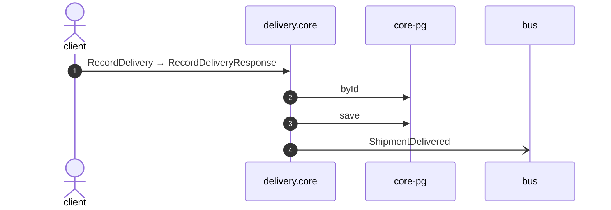

# Record delivery

*Generated from the portolan catalog · commit `11 sources` · at 2026-09-05T13:47:23+07:00. Do not edit by hand.*

- **Id:** `flow.core-record-delivery`
- **Owner:** [delivery](../delivery/README.md)
- **Source:** [`examples/shop/delivery/core/src/infrastructure/transport/grpc/shipment/handlers.ts`](https://github.com/shortlink-org/portolan/blob/main/examples/shop/delivery/core/src/infrastructure/transport/grpc/shipment/handlers.ts)

Ends a shipment at the door.

## Participants

| Participant | Kind | Context |
| --- | --- | --- |
| `client` | actor | — |
| `delivery.core` | service | [delivery](../delivery/README.md) |
| `core-pg` | store | [delivery](../delivery/README.md) |
| `bus` | broker | — |

## Sequence

## Steps

1. **client** → **delivery.core** — RecordDelivery → RecordDeliveryResponse
   status: declared · [`examples/shop/delivery/core/src/infrastructure/transport/grpc/shipment/handlers.ts:36`](https://github.com/shortlink-org/portolan/blob/main/examples/shop/delivery/core/src/infrastructure/transport/grpc/shipment/handlers.ts#L36)

2. **delivery.core** → **core-pg** — byId
   status: declared · [`examples/shop/delivery/core/src/application/shipment/usecases/record_delivery/usecase.ts:11`](https://github.com/shortlink-org/portolan/blob/main/examples/shop/delivery/core/src/application/shipment/usecases/record_delivery/usecase.ts#L11)

3. **delivery.core** → **core-pg** — save
   status: declared · [`examples/shop/delivery/core/src/application/shipment/usecases/record_delivery/usecase.ts:13`](https://github.com/shortlink-org/portolan/blob/main/examples/shop/delivery/core/src/application/shipment/usecases/record_delivery/usecase.ts#L13)

4. **delivery.core** → **bus** — ShipmentDelivered
   [`delivery.core.shipment.ShipmentDelivered`](../delivery/core/aggregates/shipment.md#event-delivery-core-shipment-shipmentdelivered) · status: declared · [`examples/shop/delivery/core/src/application/shipment/usecases/record_delivery/usecase.ts:13`](https://github.com/shortlink-org/portolan/blob/main/examples/shop/delivery/core/src/application/shipment/usecases/record_delivery/usecase.ts#L13)
