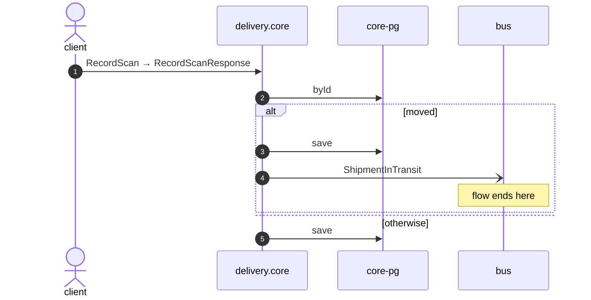

# Record scan

*Generated from the portolan catalog · commit `8 sources` · at 2026-09-05T03:58:04Z. Do not edit by hand.*

- **Id:** `flow.core-record-scan`
- **Owner:** [delivery](../delivery/README.md)
- **Source:** [`examples/shop/delivery/core/src/infrastructure/transport/grpc/shipment/handlers.ts`](https://github.com/shortlink-org/portolan/blob/main/examples/shop/delivery/core/src/infrastructure/transport/grpc/shipment/handlers.ts)

Writes down that a parcel was seen somewhere.

## Participants

| Participant | Kind | Context |
| --- | --- | --- |
| `client` | actor | — |
| `delivery.core` | service | [delivery](../delivery/README.md) |
| `core-pg` | store | [delivery](../delivery/README.md) |
| `bus` | broker | — |

## Sequence

## Steps

1. **client** → **delivery.core** — RecordScan → RecordScanResponse
   status: declared · [`examples/shop/delivery/core/src/infrastructure/transport/grpc/shipment/handlers.ts:29`](https://github.com/shortlink-org/portolan/blob/main/examples/shop/delivery/core/src/infrastructure/transport/grpc/shipment/handlers.ts#L29)

2. **delivery.core** → **core-pg** — byId
   status: declared · [`examples/shop/delivery/core/src/application/shipment/usecases/record_scan/usecase.ts:17`](https://github.com/shortlink-org/portolan/blob/main/examples/shop/delivery/core/src/application/shipment/usecases/record_scan/usecase.ts#L17)

> **One of**
>
> *moved — *ends the flow**
>
> 
> 3. **delivery.core** → **core-pg** — save
>    status: declared · [`examples/shop/delivery/core/src/application/shipment/usecases/record_scan/usecase.ts:20`](https://github.com/shortlink-org/portolan/blob/main/examples/shop/delivery/core/src/application/shipment/usecases/record_scan/usecase.ts#L20)
> 
> 4. **delivery.core** → **bus** — ShipmentInTransit
>    [`delivery.core.shipment.ShipmentInTransit`](../delivery/core/aggregates/shipment.md#event-delivery-core-shipment-shipmentintransit) · status: declared · [`examples/shop/delivery/core/src/application/shipment/usecases/record_scan/usecase.ts:20`](https://github.com/shortlink-org/portolan/blob/main/examples/shop/delivery/core/src/application/shipment/usecases/record_scan/usecase.ts#L20)
>
> *otherwise*

5. **delivery.core** → **core-pg** — save
   status: declared · [`examples/shop/delivery/core/src/application/shipment/usecases/record_scan/usecase.ts:23`](https://github.com/shortlink-org/portolan/blob/main/examples/shop/delivery/core/src/application/shipment/usecases/record_scan/usecase.ts#L23)
