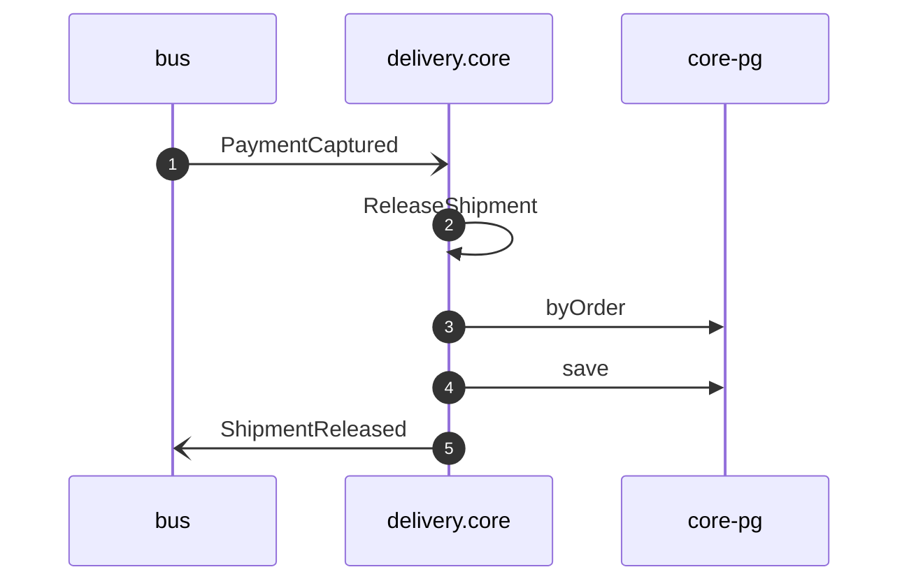

# Release shipment on payment captured

*Generated from the portolan catalog · commit `7 sources` · at 2026-09-05T03:58:04Z. Do not edit by hand.*

- **Id:** `flow.core-release-shipment-on-payment-captured`
- **Owner:** [delivery](../delivery/README.md)
- **Source:** [`examples/shop/delivery/core/src/application/policy/release-shipment-on-payment-captured.ts`](https://github.com/shortlink-org/portolan/blob/main/examples/shop/delivery/core/src/application/policy/release-shipment-on-payment-captured.ts)

Nothing leaves the warehouse before the money has moved (ADR core.0002).

## Participants

| Participant | Kind | Context |
| --- | --- | --- |
| `bus` | broker | — |
| `delivery.core` | service | [delivery](../delivery/README.md) |
| `core-pg` | store | [delivery](../delivery/README.md) |

## Sequence

## Steps

1. **bus** → **delivery.core** — PaymentCaptured
   [`payments.ledger.payment.PaymentCaptured`](../payments/ledger/aggregates/payment.md#event-payments-ledger-payment-paymentcaptured) · status: declared · [`examples/shop/delivery/core/src/application/policy/release-shipment-on-payment-captured.ts:15`](https://github.com/shortlink-org/portolan/blob/main/examples/shop/delivery/core/src/application/policy/release-shipment-on-payment-captured.ts#L15)

2. **delivery.core** ↺ **delivery.core** — ReleaseShipment
   status: declared · [`examples/shop/delivery/core/src/application/policy/release-shipment-on-payment-captured.ts:18`](https://github.com/shortlink-org/portolan/blob/main/examples/shop/delivery/core/src/application/policy/release-shipment-on-payment-captured.ts#L18)

3. **delivery.core** → **core-pg** — byOrder
   status: declared · [`examples/shop/delivery/core/src/application/shipment/usecases/release_shipment/usecase.ts:15`](https://github.com/shortlink-org/portolan/blob/main/examples/shop/delivery/core/src/application/shipment/usecases/release_shipment/usecase.ts#L15)

4. **delivery.core** → **core-pg** — save
   status: declared · [`examples/shop/delivery/core/src/application/shipment/usecases/release_shipment/usecase.ts:17`](https://github.com/shortlink-org/portolan/blob/main/examples/shop/delivery/core/src/application/shipment/usecases/release_shipment/usecase.ts#L17)

5. **delivery.core** → **bus** — ShipmentReleased
   [`delivery.core.shipment.ShipmentReleased`](../delivery/core/aggregates/shipment.md#event-delivery-core-shipment-shipmentreleased) · status: declared · [`examples/shop/delivery/core/src/application/shipment/usecases/release_shipment/usecase.ts:17`](https://github.com/shortlink-org/portolan/blob/main/examples/shop/delivery/core/src/application/shipment/usecases/release_shipment/usecase.ts#L17)
