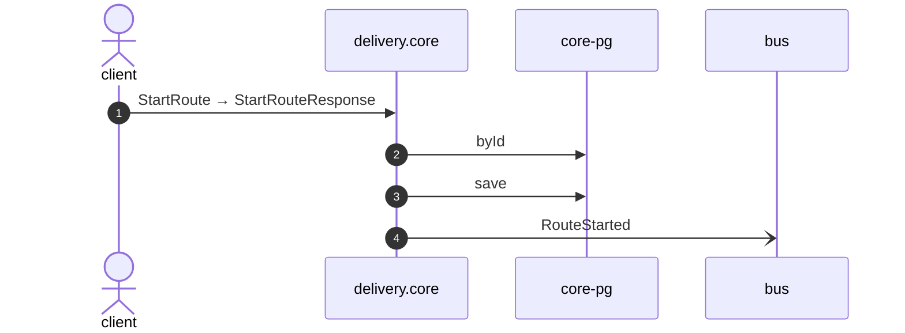

# Start route

*Generated from the portolan catalog · commit `8 sources` · at 2026-09-05T03:58:04Z. Do not edit by hand.*

- **Id:** `flow.core-start-route`
- **Owner:** [delivery](../delivery/README.md)
- **Source:** [`examples/shop/delivery/core/src/infrastructure/transport/grpc/route/handlers.ts`](https://github.com/shortlink-org/portolan/blob/main/examples/shop/delivery/core/src/infrastructure/transport/grpc/route/handlers.ts)

The van is out.

## Participants

| Participant | Kind | Context |
| --- | --- | --- |
| `client` | actor | — |
| `delivery.core` | service | [delivery](../delivery/README.md) |
| `core-pg` | store | [delivery](../delivery/README.md) |
| `bus` | broker | — |

## Sequence

## Steps

1. **client** → **delivery.core** — StartRoute → StartRouteResponse
   status: declared · [`examples/shop/delivery/core/src/infrastructure/transport/grpc/route/handlers.ts:23`](https://github.com/shortlink-org/portolan/blob/main/examples/shop/delivery/core/src/infrastructure/transport/grpc/route/handlers.ts#L23)

2. **delivery.core** → **core-pg** — byId
   status: declared · [`examples/shop/delivery/core/src/application/route/usecases/start_route/usecase.ts:11`](https://github.com/shortlink-org/portolan/blob/main/examples/shop/delivery/core/src/application/route/usecases/start_route/usecase.ts#L11)

3. **delivery.core** → **core-pg** — save
   status: declared · [`examples/shop/delivery/core/src/application/route/usecases/start_route/usecase.ts:13`](https://github.com/shortlink-org/portolan/blob/main/examples/shop/delivery/core/src/application/route/usecases/start_route/usecase.ts#L13)

4. **delivery.core** → **bus** — RouteStarted
   [`delivery.core.route.RouteStarted`](../delivery/core/aggregates/route.md#event-delivery-core-route-routestarted) · status: declared · [`examples/shop/delivery/core/src/application/route/usecases/start_route/usecase.ts:13`](https://github.com/shortlink-org/portolan/blob/main/examples/shop/delivery/core/src/application/route/usecases/start_route/usecase.ts#L13)
