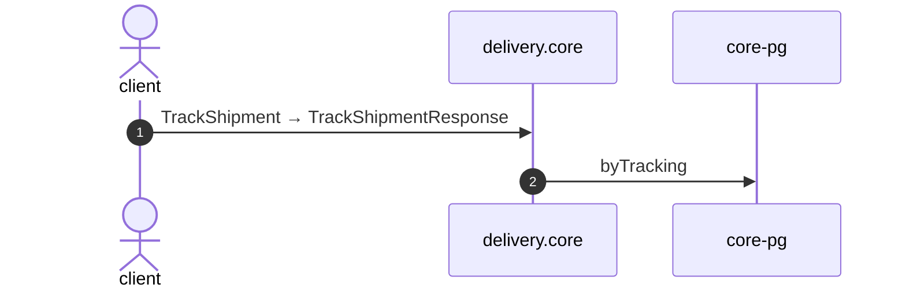

# Track shipment

*Generated from the portolan catalog · commit `7 sources` · at 2026-08-29T09:14:22Z. Do not edit by hand.*

- **Id:** `flow.core-track-shipment`
- **Owner:** [delivery](../delivery/README.md)
- **Source:** `examples/shop/delivery/core/src/infrastructure/transport/grpc/shipment/handlers.ts`

What the customer sees when they paste a tracking code.

## Participants

| Participant | Kind | Context |
| --- | --- | --- |
| `client` | actor | — |
| `delivery.core` | service | [delivery](../delivery/README.md) |
| `core-pg` | store | [delivery](../delivery/README.md) |

## Sequence

## Steps

1. **client** → **delivery.core** — TrackShipment → TrackShipmentResponse
   status: declared · `examples/shop/delivery/core/src/infrastructure/transport/grpc/shipment/handlers.ts:43`
2. **delivery.core** → **core-pg** — byTracking
   status: declared · `examples/shop/delivery/core/src/application/shipment/usecases/track_shipment/usecase.ts:9`
