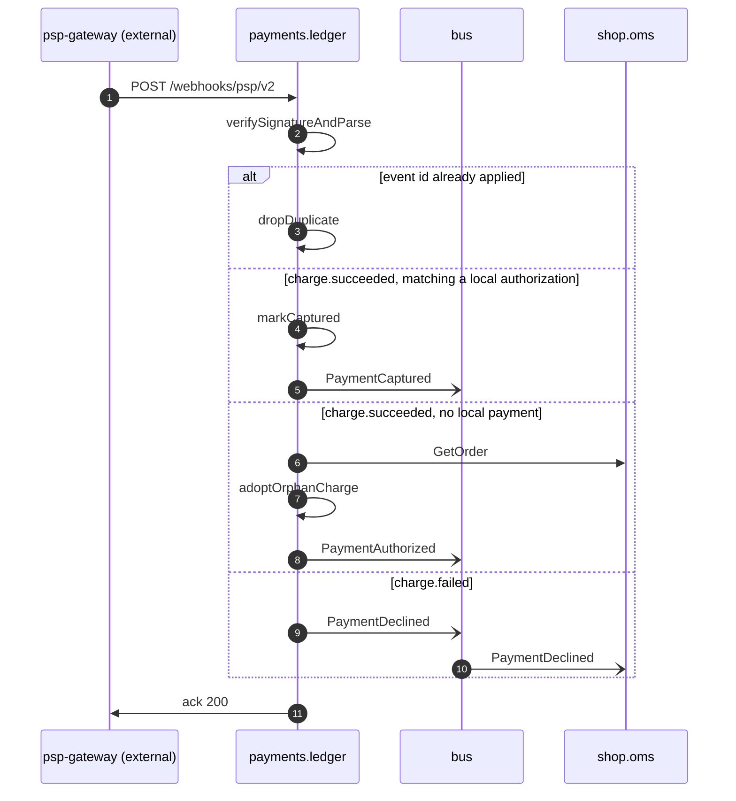

# Gateway webhook

*Generated from the portolan catalog · commit `5 sources` · at 2026-08-29T09:14:22Z. Do not edit by hand.*

- **Id:** `flow.gateway-webhook`
- **Owner:** [payments](../payments/README.md)
- **Source:** `services/ledger/test/integration/webhook_test.go`

The gateway's side of the story, arriving after the fact. One signed callback, four ways to read it: a replay to ignore, a capture to record, a charge with no local payment to adopt, and a failure to pass on. The adopt branch is the only repair for a checkout that timed out mid-authorization, and it is the one branch no test covers.

## Participants

| Participant | Kind | Context | Label |
| --- | --- | --- | --- |
| `psp-gateway` | external | — | psp-gateway (external) |
| `payments.ledger` | service | [payments](../payments/README.md) | — |
| `bus` | broker | — | — |
| `shop.oms` | service | [shop](../shop/README.md) | — |

## Sequence

## Steps

1. **psp-gateway** → **payments.ledger** — POST /webhooks/psp/v2
   `webhook_test.go:38` · HMAC-signed body. The gateway retries for three days with backoff until it gets a 2xx, so every branch below has to tolerate being run twice.
2. **payments.ledger** ↺ **payments.ledger** — verifySignatureAndParse
   `internal/ledger/adapter/psp/webhook.go:44` · A bad signature is answered 401 and never reaches the dedup table. The test drives a tampered body for this.

> **One of**
>
> *event id already applied*
>
> 3. **payments.ledger** ↺ **payments.ledger** — dropDuplicate
>    `webhook_test.go:71` · Dedup table keyed by the gateway's event id, rows kept 30 days. A replay older than that would be applied again; nothing guards it.
>
> *charge.succeeded, matching a local authorization*
>
> 4. **payments.ledger** ↺ **payments.ledger** — markCaptured
>    `internal/ledger/app/webhook.go:96`
> 5. **payments.ledger** → **bus** — PaymentCaptured
>    [payments.ledger.payment.PaymentCaptured](../payments/ledger/aggregates/payment.md) · `webhook_test.go:104`
>
> *charge.succeeded, no local payment*
>
> 6. **payments.ledger** → **shop.oms** — GetOrder
>    `shop.v1.OrderService/GetOrder` · status: declared · `internal/ledger/app/webhook.go:132` · The order reference travels in the gateway's metadata. The ledger reads the order back to decide whether the charge belongs to this estate at all.
> 7. **payments.ledger** ↺ **payments.ledger** — adoptOrphanCharge
>    status: declared · `internal/ledger/app/webhook.go:151` · Closes the gap left when the synchronous Authorize in checkout timed out after the gateway had already charged. Read from the code; the integration suite has no fixture for it, and it is the only path that keeps a customer from being charged for an order the estate never opened.
> 8. **payments.ledger** → **bus** — PaymentAuthorized
>    [payments.ledger.payment.PaymentAuthorized](../payments/ledger/aggregates/payment.md) · status: declared · `internal/ledger/app/webhook.go:168` · Published late and out of order — consumers see the authorization after the charge already settled.
>
> *charge.failed*
>
> 9. **payments.ledger** → **bus** — PaymentDeclined
>    [payments.ledger.payment.PaymentDeclined](../payments/ledger/aggregates/payment.md) · `webhook_test.go:126`
> 10. **bus** → **shop.oms** — PaymentDeclined
>    [payments.ledger.payment.PaymentDeclined](../payments/ledger/aggregates/payment.md) · status: declared · `webhook_test.go:131`

11. **payments.ledger** → **psp-gateway** — ack 200
   `webhook_test.go:142` · Acked only after the branch above has committed. Anything else and the gateway replays, which is what makes the dedup table load-bearing.
