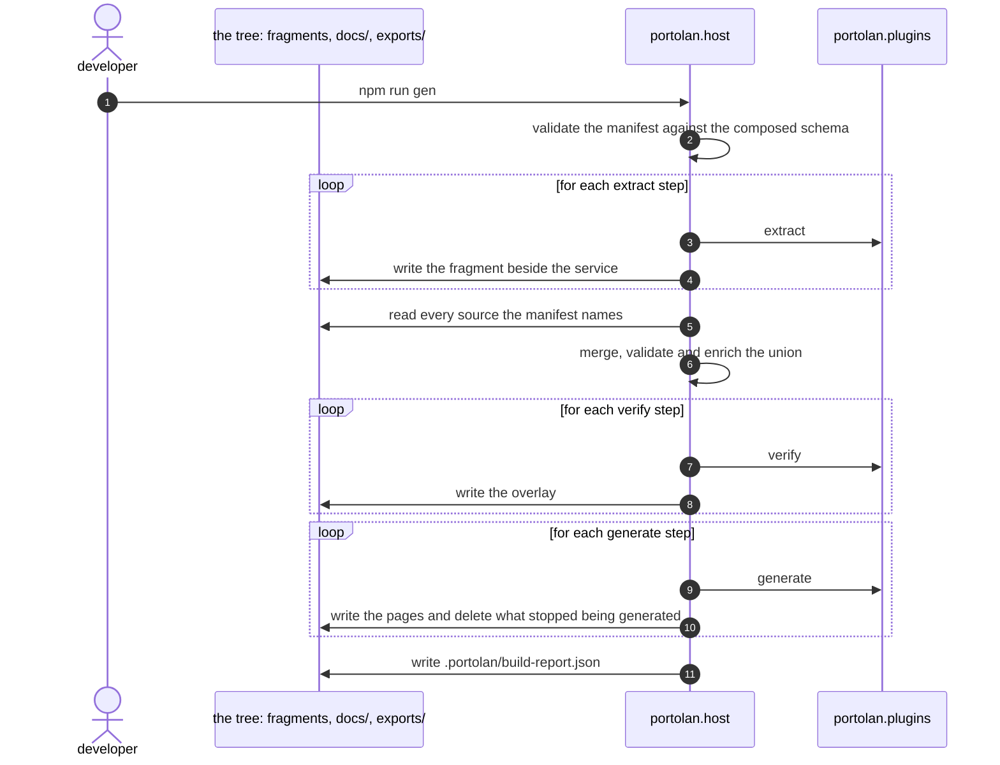

# npm run gen

*Generated from the portolan catalog · commit `5 sources` · at 2026-09-06T20:39:44+07:00. Do not edit by hand.*

- **Id:** `flow.gen`
- **Owner:** [portolan](../portolan/README.md)
- **Source:** [`scripts/gen.mjs`](https://github.com/shortlink-org/portolan/blob/main/scripts/gen.mjs)

Three passes over the manifest, each after the previous one's files are on disk: extract reads trees and specifications into fragments, verify overlays evidence on the merged catalog, generate turns it into pages. Every plugin is one JSON message in and one out; the host writes, the plugin never does.

In `--check` mode the same run writes nothing and fails on the first file that differs from disk, which is what makes committed output reviewable.

## Participants

| Participant | Kind | Context | Label |
| --- | --- | --- | --- |
| `developer` | actor | — | — |
| `tree` | store | [portolan](../portolan/README.md) | the tree: fragments, docs/, exports/ |
| `portolan.host` | service | [portolan](../portolan/README.md) | — |
| `portolan.plugins` | service | [portolan](../portolan/README.md) | — |

## Sequence

## Steps

1. **developer** → **portolan.host** — npm run gen
   status: declared

2. **portolan.host** ↺ **portolan.host** — validate the manifest against the composed schema
   status: declared · schema/portolan.schema.json is what every declared plugin said it can be told, composed by npm run schema.

> **Repeats** — for each extract step
>
> 
> 3. **portolan.host** → **portolan.plugins** — extract
>    status: declared · [`scripts/gen.mjs:121`](https://github.com/shortlink-org/portolan/blob/main/scripts/gen.mjs#L121) · The request carries the input root, its stamp and the step's options. The stamp is the last commit that touched the root, never a clock (portolan.0002).
> 
> 4. **portolan.host** → **tree** — write the fragment beside the service
>    status: declared

5. **portolan.host** → **tree** — read every source the manifest names
   status: declared · [`scripts/catalog-sources.mjs:28`](https://github.com/shortlink-org/portolan/blob/main/scripts/catalog-sources.mjs#L28)

6. **portolan.host** ↺ **portolan.host** — merge, validate and enrich the union
   status: declared · The same code the site runs: src/merge.ts, src/catalog.ts, src/enrich.ts. A fragment naming a peer it does not own is normal; integrity holds over the union.

> **Repeats** — for each verify step
>
> 
> 7. **portolan.host** → **portolan.plugins** — verify
>    status: declared · [`scripts/gen.mjs:135`](https://github.com/shortlink-org/portolan/blob/main/scripts/gen.mjs#L135) · The merged catalog rides in the request; the answer is an overlay fragment with what the evidence showed.
> 
> 8. **portolan.host** → **tree** — write the overlay
>    status: declared

> **Repeats** — for each generate step
>
> 
> 9. **portolan.host** → **portolan.plugins** — generate
>    status: declared · [`scripts/gen.mjs:165`](https://github.com/shortlink-org/portolan/blob/main/scripts/gen.mjs#L165) · A wasm module with nothing preopened, or a process. It names files and never writes them (portolan.0001).
> 
> 10. **portolan.host** → **tree** — write the pages and delete what stopped being generated
>    status: declared

11. **portolan.host** → **tree** — write .portolan/build-report.json
   status: declared
